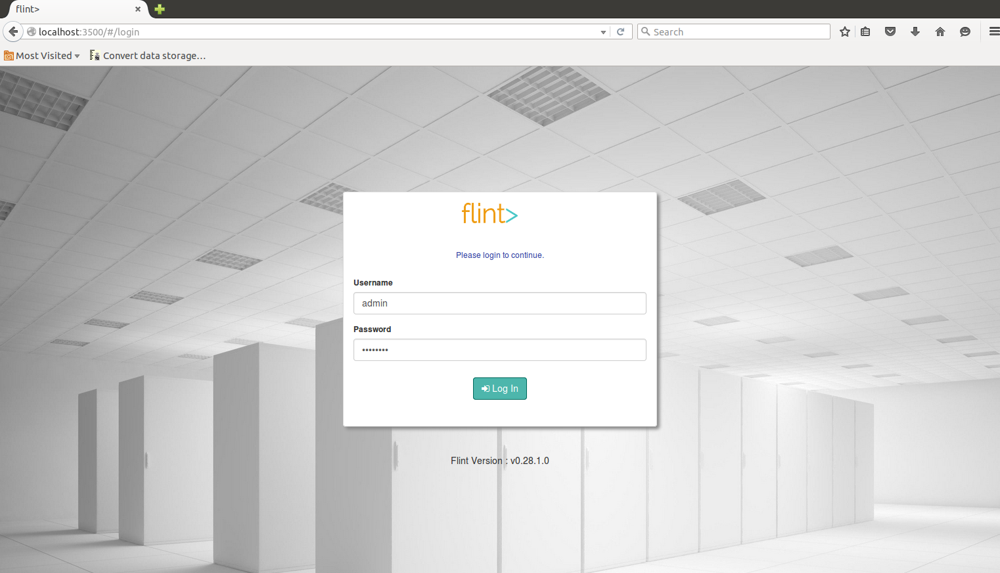

## System Requirements

| Parameter | Minimum Required |
| ------ | ----------- |
| Operating system | Linux/UNIX/MacOS or Windows platforms ( 64-bit ) that supports Java |
| Hardware | 2 CPU, 4 GB RAM |
| Environment | JDK "1.8.0_45" or higher. Make sure the JDK bin directory is on your PATH ( `java -version` to verify ) |


## Download Flint
As we have prepared our system, let’s grab Flint !

Flint follows a standard practice for its build versioning: major.minor.patchlevel.hotfix.

<a href="http://www.getflint.io/get-flint" target="_blank">Download Flint here</a>

##  Uncompress Flint

#### For UNIX/Linux

```bash
$ cd <file download directory>
$ unzip flint-x.x.x.x.zip
```

#### For Windows

Extract the files and folders from the zipped tarball into a directory of your choice.

Locate the compressed folder i.e flint-x.x.x.x.zip that you want to extract files and folders from. To extract the entire contents of the compressed folder, right-click the folder, click Extract All, and then follow the instructions.

>>>>> Compressed folder flint-x.x.x.x.zip is the downloaded Flint distribution version. For example : flint-0.1.0.0.zip

## Start Flint
After deployment of Flint build, we just need to kick-start it as below-

#### On UNIX/Linux
``` bash
$ cd flint-x.x.x.x
$ sh flint.sh start
```
>>>>> You can also **start Flint in a daemon mode**, to do so issue the following command: `sh flint.sh -d start`. To see list of available arguments run: `sh flint.sh`

#### On Windows
``` bash
cd flint-x.x.x.x
flint.bat start
```
>>>>> You can also install and start **Flint as Windows service**, to do so open an Administrator command prompt and issue the following command: `flint.bat installservice`. To see list of available arguments run: `flint.bat`

This will brings up the first worknode/instance of Flint Grid.

## Verify Flint Installation

To verify that the Flint process has started successfully, point your browser at: <a href="http://localhost:3500" target="_blank">http://localhost:3500</a> If you see the Login screen as in below screenshot, then you're all set to go.

**Default Login Credentials: Username = admin and Password = admin123**



## Stop Flint
As needed, you can stop the Flint process just by pressing **Ctrl+C**


#### On UNIX/Linux
If you have started Flint in the daemon mode, then to stop Flint issue the following command :
``` bash
$ cd flint-x.x.x.x
$ sh flint.sh stop
```

#### On Windows
If you have started Flint as a windows service, then to stop and uninstall Flint open an Administrator command prompt and issue the following command :
``` bash
flint.bat uninstallservice
```

---
## Install Flint on remote server or cloud virtual machine
To install flint on remore server you need to perform some additional configuration

* Update **flint.cluster.hostname** parameter in **config/application.cfg** with hostname of server
* Update **tcp-ip/member** parameter in **config/cluster.xml** with hostname of server
  ``` xml
    <tcp-ip enabled="true" connection-timeout-seconds="10">
      <member>node.hostname.com</member>
    </tcp-ip>

  ```
* Make sure you have configured DNS or **hosts** file to point configured hostname to server's IP address
  * Unix/Linux: `vi /etc/hosts`
  * Windows: `notepad %SystemRoot%\System32\drivers\etc\hosts`
