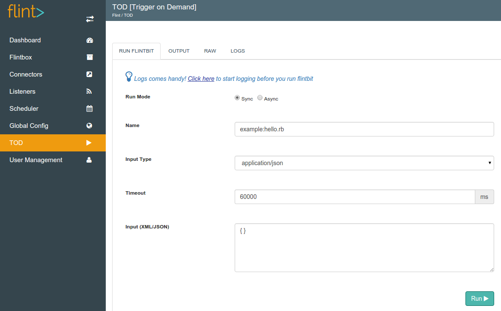
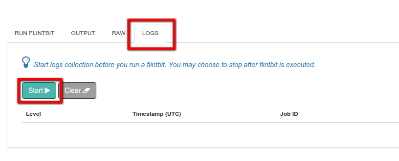
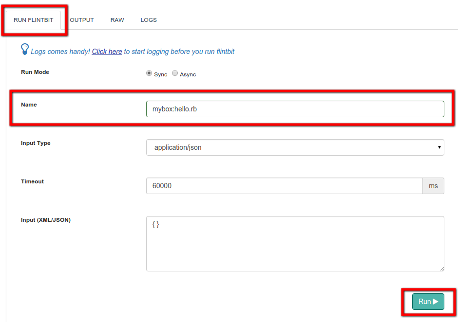
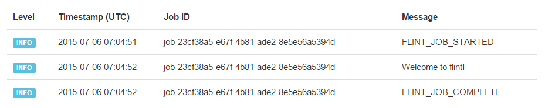
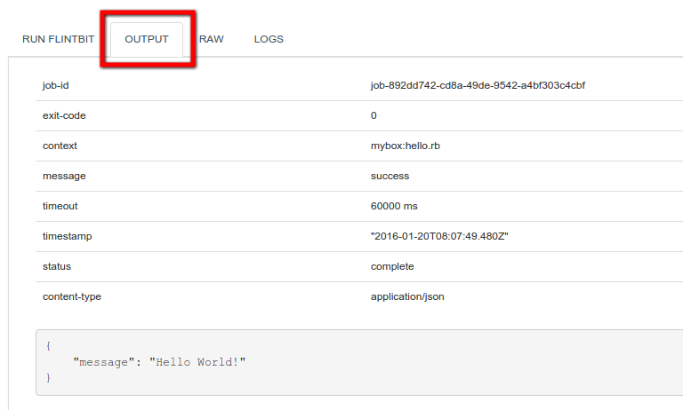

## Kick-start with 'Hello World'

To get started with Flint, we have defined the standard "hello world" example.

>>>>> This guide assumes that you have already installed flint locally on your workstation.


## Create your first Flintbox

#### What is a Flintbox?

> Flintbox is a collection of similar Flintbits in git repository

Flintbox is a git repository which contains or hold all the Flintbits (workflows written in Ruby or Groovy). These are the collection of similar types of Flintbits.

In production or remote Flint deployment, Flintbox are always cloned from git repository into the 'Flintbox' directory. In development setup and when running Flint locally, you can directly open and edit them in your favorite text editor.

#### Create Flintbox

We will create a Flintbox named 'mybox' under the 'flintbox' directory.

To create a Flintbox-
* Navigate to flint-x.x.x.x ( Flint installation directory )
* Navigate to flintbox directory
* Create a directory named 'mybox' to store flintbits.
* This can be performed by executing the below commands on a new terminal.

``` bash
$ cd flint-x.x.x.x
$ cd flintbox
$ mkdir mybox
```


## Create your first Flintbit

#### What is a Flintbit?

> Flintbit = ruby or groovy scripts (workflows) developed and stored within Flintbox

Flintbit is a ruby or groovy script, which contains your business logic. It uses [Flintbit functions](../flintbit_functions) to get input, call connectors and other Flintbits and finally to set output.

All Flintbits are accessible via RESTful APIs, thus making them micro-services.


#### Create Flintbit

To create a Flintbit, navigate to mybox directory using your favorite code editor.

Create a ruby or groovy Flintbit under 'mybox' directory. You can copy paste the following code :

``` ruby
# for hello.rb
@log.info("Welcome to flint!")
@output.set("message","Hello World!")
```
``` java
// For hello.groovy
log.info("Welcome to flint!")
output.set("message","Hello World!")
```
>>>>> `@log.info` and `@output.set` are the Flintbit functions that are readily available to all Flintbits. For list of objects and functions that Flint provides, refer [Flintbit functions](../flintbit_functions) section.

#### Flintbit reference path or Flintbit name
When you want to refer your Flintbit in Flint, you may use path convention used within Flint. This is simple and easy to remember where folder name (Flintbox) and Flintbits are separated by **colon (:)** operator.

Following example shows the folder structure and path to refer the Flintbits
```
flintbox
├── mybox             # our new flintbox
    ├── hello.groovy  # mybox:hello.rb
    └── hello.rb      # mybox:hello.groovy
```

## Run the Flintbit

#### Open TOD Console
Open the Flint console in the browser and navigate to Trigger on Demand [TOD] screen



#### Enable Logs
Before running the Flintbit, we will enable the logs to be display on Flint console. This will show realtime logs from the running script. This could be useful when developing and debugging Flintbits.



#### Run Flintbit hello.rb or hello.groovy
Now that the logs are enabled lets run the Flintbit


Upon execution of Flintbit logs will be displayed as below


You may check the output of the Flintbit execution from the 'Output' tab


For more information on using trigger on demand console see [Trigger on Demand](../../grid_configuration/trigger_on_demand) section.

> That's it! We have just executed our first Flintbit.

#### Using REST Client

Execution of a Flintbit can be done via RESTful APIs. Flint REST APIs documentation can be found at [REST API](../../api/rest)

You can access REST APIs by using any REST client or HTTP/REST Client library.

## Configure Git Repository for Flintbox

Once you are done with your development and testing. You can commit your Flintbox to git repository. This will enable you with-
* Version control the automation workflows
* Share Flintbox with others and provide resusability
* Deploy it to Flint production environments

#### Initialize a repository for 'mybox'

``` bash
$ cd mybox
$ git init
```
#### Add hello.rb/hello.groovy to the new 'mybox.git'
``` bash
$ git add .
$ git commit -m "hello world flintbits"
$ git remote add origin https://github.com/username/mybox.git
$ git push -u origin master
```
