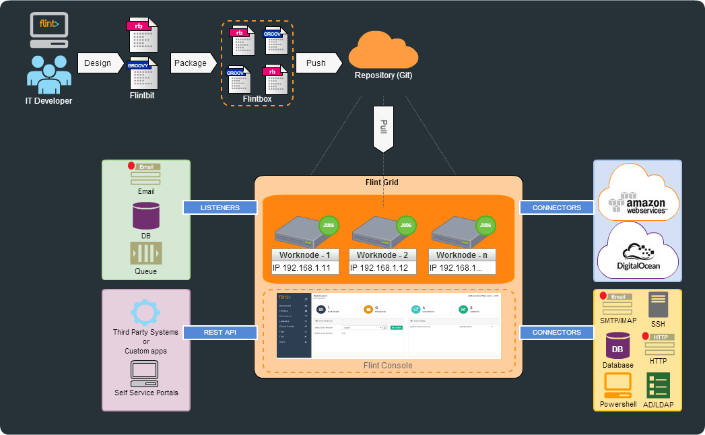

## Flintbox

> flintbox is collection of similar flintbits in git repository

Flintbox is a git repository which contains or hold all the flintbits (workflows written in Ruby or Groovy). They are collection of similar functioning flintbits. F

Flintbox can be deployed independently and are version-ed in git repository.

## Flintbit

> ruby or groovy scripts stored inside flintbox

Flintbit is a ruby or groovy script, which contain your business logic. It uses 'flitbit functions' to get input, call connectors and other flintbits and finally to set output.

Flintbits accept JSON as input give out JSON as output. All flintbits are accessible via RESTful APIs making them micro-services.

## Flintbit objects and functions

> objects and functions that are used to interact with flint from your scripts

Flintbit functions are readily available in all the flintbits.

They are used to:
* Read JSON or XML input. e.g. `@input.get("name")`
* Log messages to log file and to console. e.g `@log.info("some message")`
* Call connectors and pass arguments to it. e.g. `@call.connector("connector_name")`
* Call/Run other flintbits and pass input to them. e.g. `@call.bit("example:hello.rb")`
* Set output of the flintbit. e.g `@output.set("message","hello")`

For list of objects and functions that flint provides see [Flintbit functions](../flintbit_functions) section.

## Flint Job

> Each flintbit run is a job with a unique job-id

## Flint WorkNode

> Instance of flint running on physical or virtual server

## Flint Grid

> A collection of one or more flint nodes connected to each other

## Connectors

> Flint components which are used to take action on external systems.

Connectors are used to communicate with the external world. For the communication to take place, connectors are configured on Grid nodes and Flintbits are used to call a connector, thus accomplishing the purpose of a connector and fulfilling your needs.

Connectors are configured on flint work nodes using flint console.

## Listeners

> Flint components that listen to events coming from external systems

Listeners listen to events from external system. For example emails arriving at a mail box or message arriving at MQTT topic. Listeners trigger configured flintbit with received event as an input to that flintbit.

Listeners are configured on flint work nodes using flint console.

## Schedules

> Enables flint to schedule running of flintbits

## Global Config

> Configuration which is available for all the flintbox and flintbits deployed on the grid

Parameters declared in Global Configuration, are visible to all the flintboxes thereby being accessible to all the flintbits. Global Config help you to avoid hard-coded variables in your flintbits.

You can Add/update Global config form Flint Console.

Global Config can be used for:
* Additional credentials that might be associated with your applications
* Remote Server configurations
* Directoy/File locations
* **Anything which can change over time.**

## Local Configuration

> Configuration which is available only to flintbox and flintbits in which the configuration is defined.
