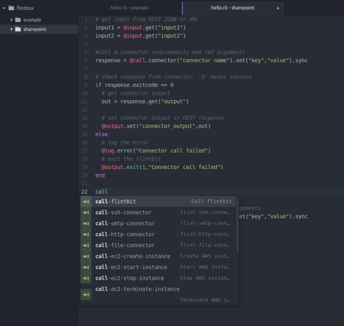
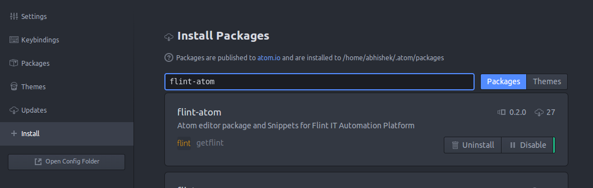

To revolutionize the way automation workflows are designed and to reduce efforts to develop new Flintbits (workflows) we have come up with package for [Atom](https://atom.io) text editor.

[Flint Atom package](https://atom.io/packages/flint-atom) can be installed on Atom 1.0 or greater.

Features of Flint Atom Package
* Syntax highlighting
* Code completion
* Code templates with error handling
* Helpful hints with code.

### Installing Flint Atom Package

* Open Atom editor
* Go to **Preferences**
* Go to **+ Install** tab
* Search for **flint-atom** package and click install

> That's it! You are ready to use atom. just open any flintbit and start writing code!
