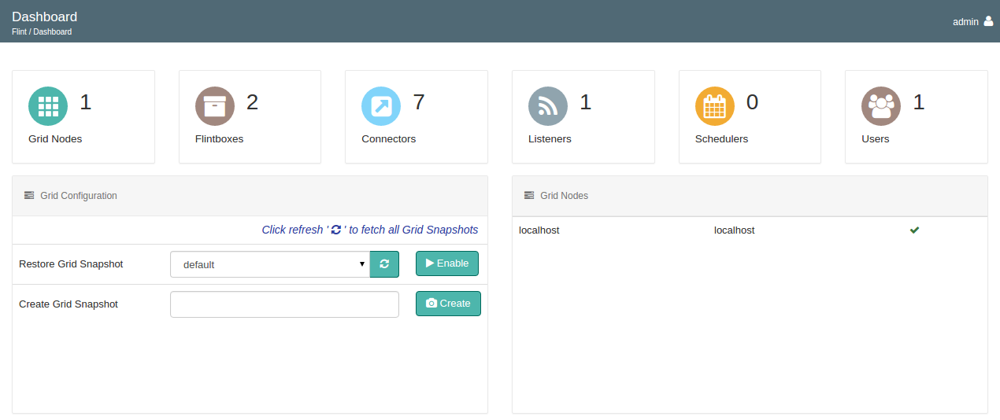

## Dashboard

Flint's dashboard gives you a gist of all the major Flint components like Flintboxes, Connectors, Listeners, Schedulers and Users. It also gives you the command to create and restore snapshot of grid configurations on nodes.

### Grid Nodes

Displays the count of nodes which are active on Grid whereas the lower section of the Dashboard gives you the list of active nodes with their host-names and IP addresses.

### Flintboxes

Displays the number of flintboxes which are configured with Flint. Flint provides you two flintboxes - “flint-util” and “example”. example is a flintbox just similar to mybox having ruby and groovy flintbits for you to get started with, whereas flint-util will help you out with the connectors and listeners.

### Connectors

Displays the number of Connectors which are configured with Flint.

### Listeners

Displays the number of Listeners which are configured with Flint. Flint provides you with IMAP listener which will monitor incoming messages, alerts, notifications etc. and thus trigger flint to take relevant action that could be in integration with other applications or systems.

### Schedulers

Scheduler provide means to trigger flintbits on demand. Using scheduler you can control the frequency of flintbit execution.

### Global Config

One time declaration of parameters, constants, flintbits belonging to the same flintbox or different referencing to a same paramater, easy maintainance, get rid of local configuration? Add Global Config to Flint

### Users

Are you an administrator of your organisation? Manage your employee's access rights to Flint using User Management

### Grid Configuration

Flint allows you to capture current state of flintboxes, connectors, listeners, global config and users.
