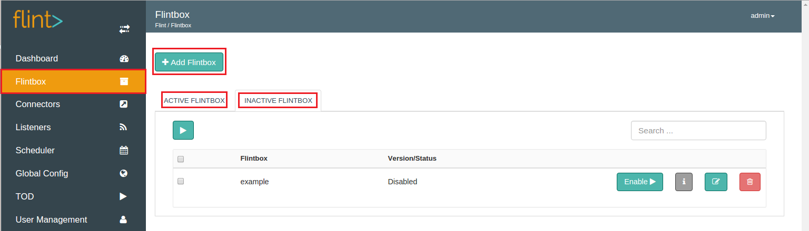
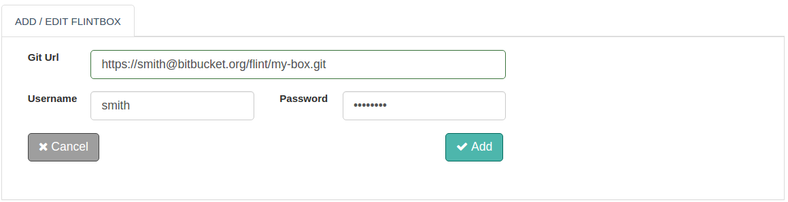

We can add and enable a Flintbox from Flint Console.
On Flint Console, Flintbox screen has three primary areas as 'Add Flintbox', 'Active Flintbox' and 'Inactive Flintbox'.

With the help of this document, you will be able to add a Flintbox on Grid.

## How to Add a Flintbox to Grid?

Let us see how we can add and enable a Flintbox in simple steps as below:

1. Log on to Flint UI Console
2. Visit the Flintbox link on left navigation bar
3. Click on Add Flintbox
4. In the form displayed, fill up necessary form fields ( as shown below )
5. Click on Add button

>>>>> The above steps will only add the flintbox. To start using the flintbox, visit the 'INACTIVE FLINTBOX' tab. Click on the Enable button against the name of your newly added Flintbox.

##### Configuration parameters
| Parameter | Description | required |
| ------ | ----------- |
| Git Url | URL of the remote git repository. After a flintbox is enabled, it will be cloned from remote git repository.  | true |
| Username | Git repository username | true for private repository |
| Password | Git repository password | true for private repository |

