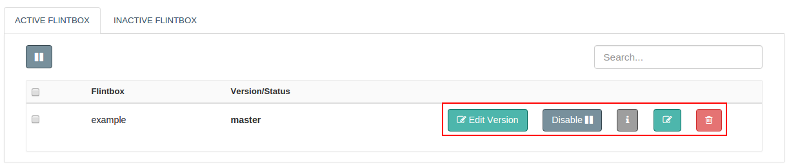

We can add and enable a Flintbox from Flint Console.
On Flint Console, Flintbox screen has three primary areas as **Add Flintbox**, **Active Flintbox** and **Inactive Flintbox**.

With the help of this document, you will be able to add a Flintbox on Grid.

## How to Add a Flintbox to Grid?

Let us see how we can add and enable a Flintbox in simple steps as below:

1. Log on to Flint UI Console
2. Visit the Flintbox link on left navigation bar
3. Click on Add Flintbox
4. In the form displayed, fill up necessary form fields ( as shown below )
5. Click on Add button

##### Configuration parameters
| Parameter | Description | required |
| ------ | ----------- |
| Git Url | URL of the remote git repository. After a Flintbox is enabled, it will be cloned from remote git repository.  | true |
| Username | Git repository username | true for private repository |
| Password | Git repository password | true for private repository |

>>>> The above steps will only add the Flintbox. To start using the Flintbox, visit the **INACTIVE FLINTBOX** tab. Click on the Enable button against the name of your newly added Flintbox.

## Flintbox Actions

1. **Enable:** Only when a Flintbox is enabled, you can actually trigger the Flintbit.
2. **Disable:**  Stops the Flintbox execution, no Flintbit can be triggered then.
3. **Edit Version:** Same as git branch name. You can choose the version of Flintbox to be enabled( default is master ).
4. **Edit:** You can change the configuration parameters here.
5. **Delete:** Completely removes the Flintbox from Flint.
6. View Information: Name, Status, Version, Git URL of the added Flintbox is shown here.
