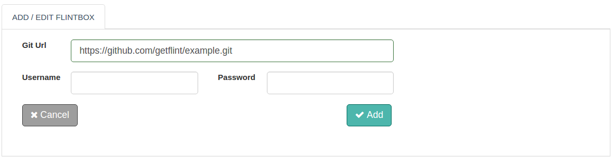

Here, you can configure all your flintboxes ( git repositories with workflows ). 
The flintbox console has three primary areas for Add Flintbox, Active Flintbox and Inactive Flintbox.

With this document guide you will be able to configure a flintbox.

## Configure Flintbox

To configure a Flintbox from Flint Console, steps are as follows:

1. Log on to Flint UI Console
2. Visit the Flintbox link on left navigation bar
3. Click on Add Flintbox
4. In the form displayed, fill up necessary form fields ( as shown below )
5. Click on Add button

>>>>> The above steps will only configure the flintbox. To enable the flintbox, visit the 'INACTIVE FLINTBOX' tab. Click on the Enable button against the name of your newly added Flintbox.

##### Configuration parameters
| Parameter | Description | required |
| ------ | ----------- |
| Git Url | URL of the remote git repository. After a flintbox is enabled, it will be cloned from remote git repository.  | true |
| Username | Git repository username | true for private repository |
| Password | Git repository password | true for private repository |

