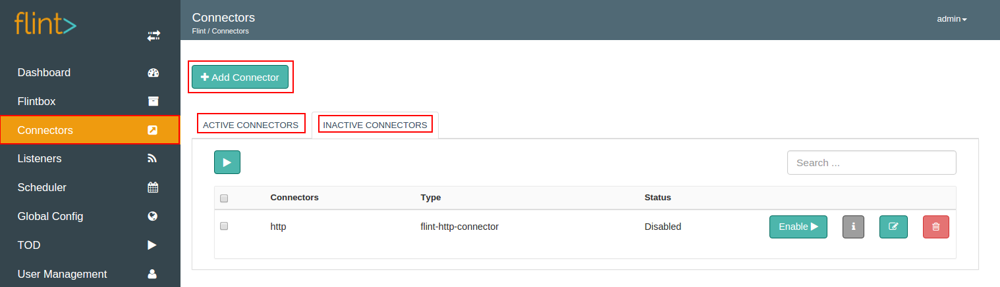
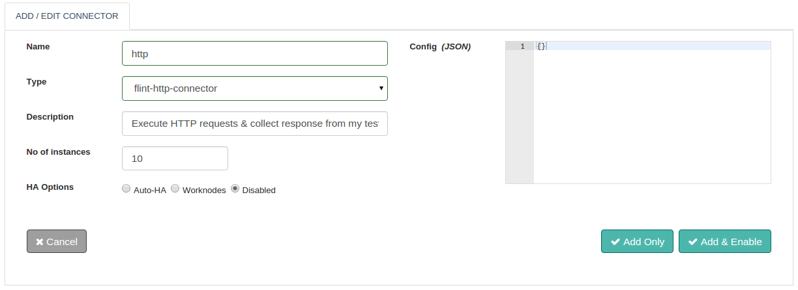
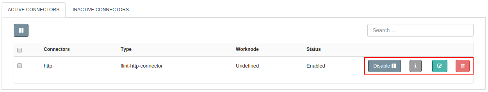

We can add and enable a Connector from Flint Console.
On Flint Console, Connectors screen has three primary areas as **Add Connector**, **Active Connectors** and **Inactive Connectors**.

With the help of this document, you will be able to add a Connector on Grid.

## How to Add a Connector to Grid?

Let us see how we can add and enable a Connector in simple steps as below:

1. Log on to Flint UI Console
2. Visit the Connectors link on left navigation bar
3. Click on Add Connector
4. In the form displayed, fill up necessary form fields ( as shown below )
5. Click on Add button

##### Configuration parameters
| Parameter | Description | required |
| ------ | ----------- |
| Name | Name of the Connector to add.  | true |
| Type | A list of all the connectors available with Flint is displayed here. Choose the connector type, from the listing. The type uses the following naming convention: flint-[connector type]-connector. Example: Type for a HTTP connector is: flint-http-connector. | true |
| Description | Summarization of the Connector | false |
| Config (JSON) | Parameters specified here are specific to the type of connector used. To add config refer to the documentation, depending upon the type selected. | true |
| Nr of instances | The number of instances with which the Connector will be enabled. Every instance is single threaded which will scale your application across all available worknodes you might want to deploy on. If omitted connector will be enabled with 10 instances. | false |
| HA Options | Flint allows you to enable the Connector with high availability ( HA ) support. <ul><li>Auto-HA: Connector will be enabled on all the configured grid nodes.</li><li>Worknodes: Connector will be enabled only on specific grid nodes whose hostnames are provided here.</li><li>Disabled: Connector will on be enabled randomly on any one of the configured grid nodes.</li></ul> | true |

>>>> The above steps will only add the connector. To start using the connector, visit the **INACTIVE FLINTBOX** tab. Click on the Enable button against the name of your newly added Connector.

## Connector Actions

1. **Enable:** Starts the connector execution. You can then use flintbits to call the connector.
2. **Disable:**  Stops the connector execution. Flintbit's call to a connector fails stating 'connector not found' if a connector is disabled.
3. **Edit:** You can change the configuration parameters here.
4. **Delete:** Completely removes the connector from Flint.
5. View Information: Name, Type, Description, High Availability, Status and Worknode of the added connector is shown here.

