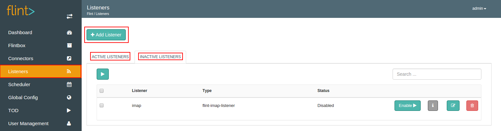
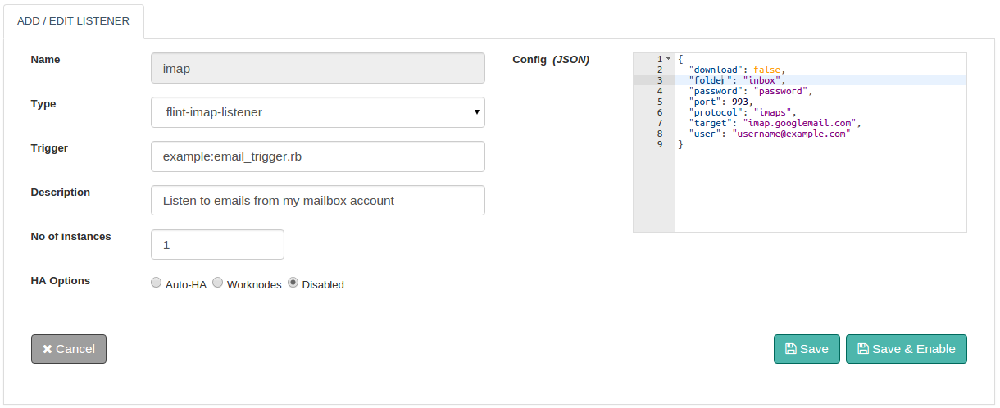
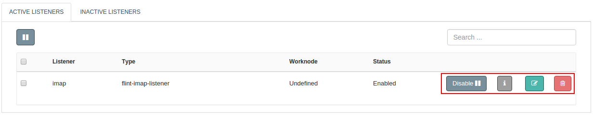

We can add and enable a Listener from Flint Console.
On Flint Console, Listeners screen has three primary areas as **Add Listener**, **Active Listeners** and **Inactive Listeners**.

With the help of this document, you will be able to add a Listener on Grid.

## How to Add a Listener to Grid?

Let us see how we can add and enable a Listener in simple steps as below:

1. Log on to Flint UI Console
2. Visit the Listeners link on left navigation bar
3. Click on Add Listener
4. In the form displayed, fill up necessary form fields ( as shown below )
5. Click on Add button

##### Configuration parameters
| Parameter | Description | required |
| ------ | ----------- |
| Name | Name of the Listener to add.  | true |
| Type | A list of all the listeners available with Flint is displayed here. Choose the listener type, from the listing. The type uses the following naming convention: flint-[listener type]-listener. Example: Type for a IMAP listener is: flint-imap-listener. | true |
| Description | Summarization of the Listener | false |
| Trigger | Flintbit reference path or Flintbit name ( flint's convention ), which will trigger Flint to take relevant action based on the type of listener. Example : example:email_trigger.rb | true |
| Nr of instances | The number of instances with which the Listener will be enabled. Every instance is single threaded which will scale your application across all available worknodes you might want to deploy on. If omitted a listener will be enabled with single instance. | false |
| HA Options | Flint allows you to enable the Listener with high availability ( HA ) support. <ul><li>Auto-HA: The behaviour of Auto-HA in listener is different from that in connector. If a worknode on which it is running fails, it will be re-started automatically on another worknode of the grid</li><li>Worknodes: Listener will be enabled only on specific grid nodes whose hostnames are provided here. Example: If flint is configured on 5 grid nodes and you choose to enable listener only on 2, then provide their hostnames here like 192.168.2.33,192.168.2.12 or saturn.outerspace.com, jupiter.outerspace.com.</li><li>Disabled: Listener will be active only on any one of the configured grid nodes.</li></ul> | true |
| Config (JSON) | Parameters specified here are specific to the type of listener used. To add config refer to the documentation, depending upon the type selected. | true |

>>>> The above steps will only add the listener. To start using the listener, visit the **INACTIVE LISTENERS** tab. Click on the Enable button against the name of your newly added Listener.

## Listener Actions

1. **Enable:** Starts the listener execution. The listener will start listening to events as soon as it is enabled and take relevant actions accordingly.
2. **Disable:**  Stops the listener execution. No events can be listened to and acted upon if a listener is disabled.
3. **Edit:** You can change the configuration parameters here.
4. **Delete:** Completely removes the listener from Flint.
5. View Information: Name, Type, Description, High Availability, Status and Worknode of the added listener is shown here.

