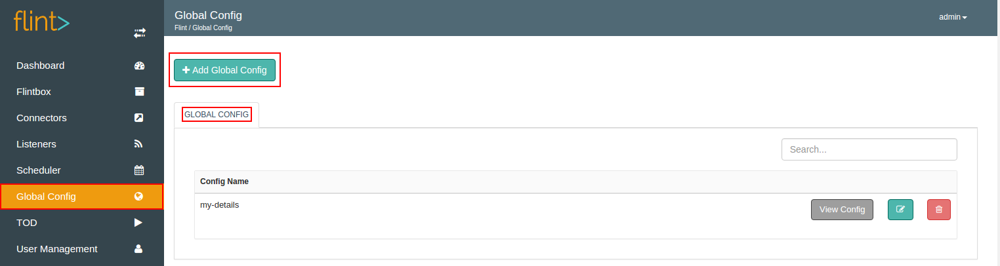
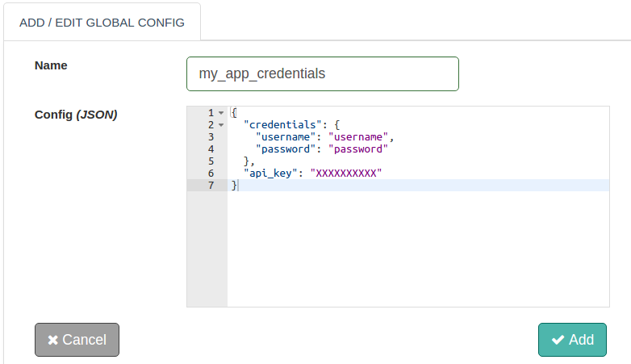
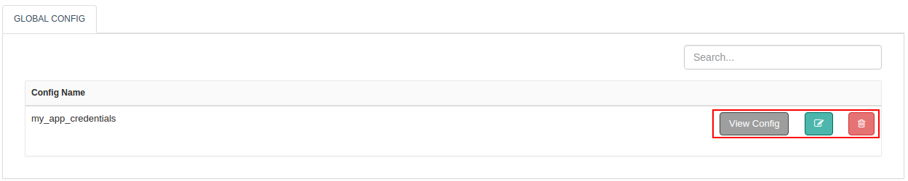

We can add Global Config from Flint Console.
We are all aware with the terminology 'global' i.e. universal scope. Flint adopts this principle in Global Config. Parameters declared here, are visible to all the Flintboxes thereby being accessible to all the Flintbits.

##### What can be declared as Global Config?

+ Remote Server configurations
+ Additional credentials that might be associated with your applications
+ Frequently used REST API URL's
+ External API keys that might be used by your application
+ Directoy/File locations and many more...

On Flint Console, Global Config screen has two primary areas as **Add Global Config** and **Global Config**.



With the help of this document, you will be able to add a Global Config.

## How to Add Global Config?

Let us see how we can add Global Config in simple steps as below:

1. Log on to Flint UI Console
2. Visit the Global Config link on left navigation bar
3. Click on Add Global Config
4. In the form displayed, fill up necessary form fields ( as shown below )
5. Click on Add button



##### Accessing Global Config parameters in Flintbit

To extract "my_app_credentials" global config parameters shown above :

``` ruby 
@config.global("my_app_credentials.credentials.username")                          #username
@config.global("my_app_credentials.credentials.password")                          #password
@config.global("my_app_credentials.api_key")                                       #api-key
```
or

``` ruby 
@config.global("my_app_credentials").get("credentials").get("username")            #username
@config.global("my_app_credentials").get("credentials").get("password")            #password
@config.global("my_app_credentials").get("api_key")                                #api-key      
```

## Global Config Actions



1. **Edit:** You can change the config(JSON) parameters here.
2. **Delete:** Completely removes the global config from Flint.
3. View Information: Config(JSON) parameters of the added global config is shown here.