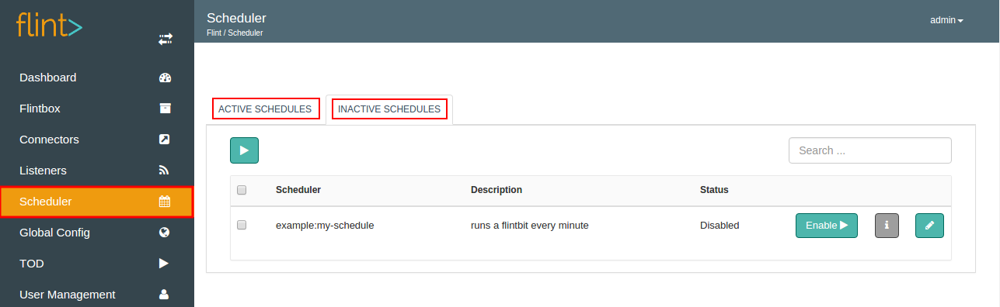

We can enable a Scheduler from Flint Console.
Flint uses cron expressions to schedule Flintbit execution.
On Flint Console, Scheduler screen has two primary areas as **Active Schedulers** and **Inactive Schedulers**.



A Flintbox comes with Scheduler's i.e you can have one or more scheduler added to a Flintbox.
With the help of this document, you will be able to add a Scheduler on Grid.

## How to Add a Scheduler to Grid?

Let us see how we can add a Scheduler manually in simple steps as below:
  
+ Navigate to the Flintbox directory ( mybox ) to which scheduler has to be added.
   + Navigate to flint-x.x.x.x ( flint installation directory )
   + Navigate to flintbox ( flintbox directory )
   + Navigate to mybox ( created and configured flintbox directory ) 

``` bash
$ cd flint-x.x.x.x/
$ cd flintbox/
$ cd mybox/
```

+ Create the schedules.conf and paste the scheduler configuration as shown in the below example.

```
"my-schedule" {
  description = "runs a flintbit every minute"
  trigger = "hello.rb
  cron = "0 * * * * ? *"
  enable = false
  input {
    my_message = "Welcome to Flint !"
  }
}
```
>>>>>>  Need help building cron expressions? They can be readily made available with [Cron Maket](http://www.cronmaker.com/).

+ Add schedules.conf to mybox

``` bash
$ git add schedules.conf
$ git commit -m "schedule to trigger flintbit every first second" 
$ git push
```
##### Configuration parameters
| Parameter | Description | required |
| ------ | ----------- |
| scheduler-name | Name of the Scheduler to add.  | true |
| description | Summarization of the Scheduler. | false |
| trigger | Flintbit reference path or Flintbit name ( flint's convention ) to be triggered when a schedule starts running. | true |
| cron | Cron expression to schedule Flintbit execution. Example: For a scheduler to trigger Flintbit  "At every 1st second", cron expression will be "1 * * * * ? *". | true |
| enable | If true, a scheduler will be enabled automatically when the flintbox to which it belongs is enabled. Default is false | false |
| input | Contains all the parameters that have to be supplied to the Flintbit as input. Default is a empty JSON Object. | false |


>>>> The above steps will only add the scheduler. To enable the scheduler, visit the **INACTIVE SCHEDULERS** tab. Click on the Enable button against the name of your newly added Scheduler.

## Scheduler Actions


1. **Enable:** Fires the scheduler which in turn triggers the Flintbit as per the cron expression.
2. **Disable:**  Stops the scheduler execution. 
3. **Edit:** You can change the configuration parameters here.
4. View Information: Name, Description, Trigger, Input, Cron and Enable of the added scheduler is shown here.