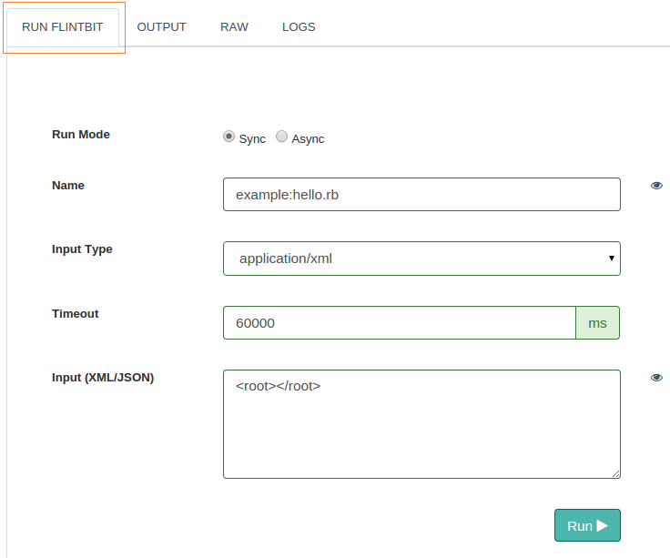
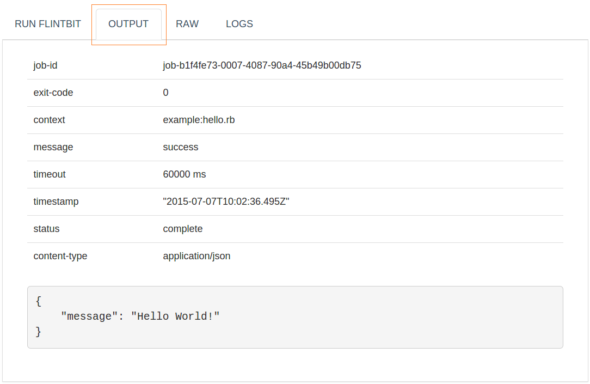
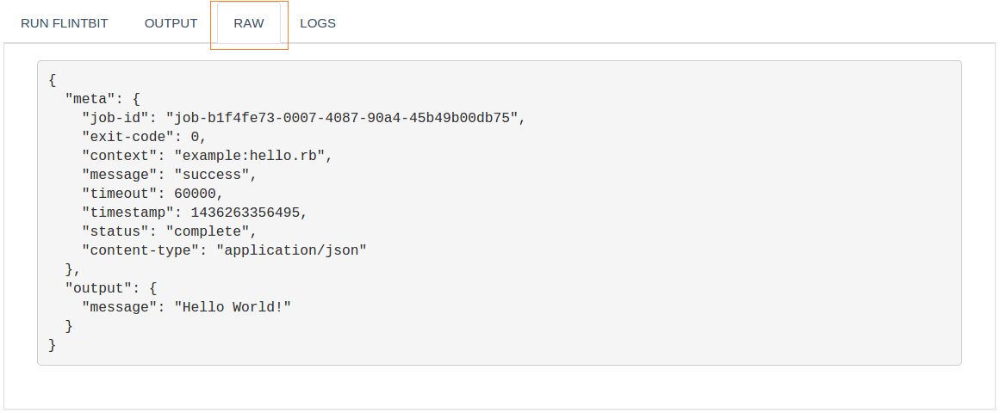
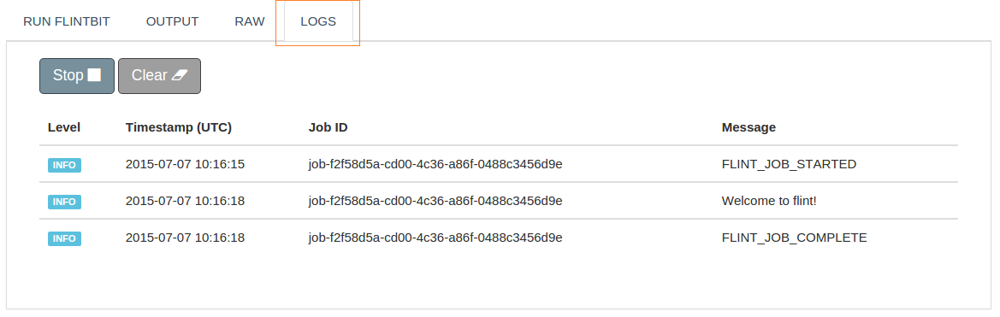

## Trigger on Demand ( TOD )

You can trigger Flintbits using Flint's TOD. Depending on your application workflow, necessary inputs can be provided to flintbits which help interact with connectors or listeners. Thus running a flintbit from TOD will not only trigger the workflow but also help us learn the response for the same with appropriate logs.

Trigger On Demand is all about - Running a Flintbit, watching output of flintbit in its well formatted and raw form and monitoring logs.


### To Run a Flintbit


#### Run Mode

Not only connectors/listeners but also flintbits can be executed in synchronously and asynchronously.

* Synchronous : Runs a flintbit in synchronous way. Default timeout of 60,000 ms will be used.
* Asynchronous : Runs a flintbit in asynchronous way straight away returning the meta object back, will not way for the job to complete.

##### Name

Name of the flintbit along with name of the flintbox name in whcih it resides. All the flintboxes by default reside in the flintbox directory. Naming convention followed :

```
flintbox-name:flintbit-name
```

where, a **colon ( : )** represents the path change.

##### Example

Generally ( a non-nested directory structure ),

``` http
example:hello.rb  
```
where, a colon ( : ) represents the path change.

In case of a nested directory structure,

``` http
http:my-requests:http_get.rb
```

A nested directory structure representing the following,each separated by a colon ( : ) :

```
-flintbox
  -http
    -my-requests
      -http_get.rb  
```
##### Input Type

Used to specify the type of input documents for flintbit. Valid input document types :

* JSON ( application/json )
* XML ( application/xml )

##### Timeout

Used to specify the timeout for a flintbit's execution in a synchronous mode. Default timeout is 60,000ms.

##### Input( XML/JSON )

Used to specify a JSON Object in case of JSON type input document or a XML document in case of XML type input document. The data given is nothing but the input to your flintbit.



<br>
### Output

Here, you can view a well structured response of your flintbit. All the parameters of the response stand out with their corresponding values eliminating the need to go through the minified version of the response. Response parameters separated out perfectly you can study values which are a matterof importance to you.



<br>
### Raw

The raw view is just a big text area with the flintbit response body. A minified version of the JSON Object or XML document will be displayed depending on the type of input supplied.



<br>
### Logs

Logs will help you walk through your workflow. With various logging levels and all possible errors captured Flint's logging will surely help you learn the workflow and debug application error if any. Its a good practice to start logs before running any flintbit.


