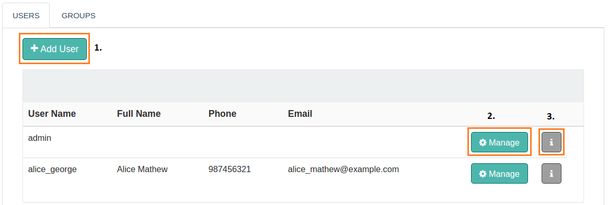
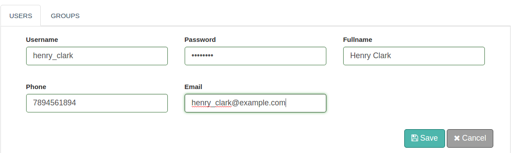
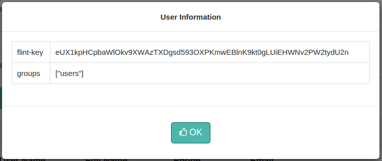
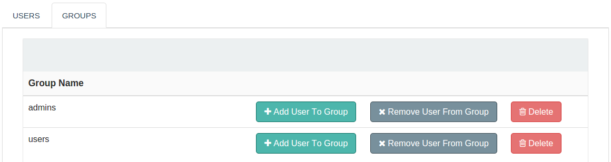

## User Management

To view, manage and add users in your organization visit the Administration link on the left navigation bar of Flint Console.

The Administration link is only visible to the administrator of the organization. Default administrator has account with credentials username admin and password admin123.

User management comprises of Users and Groups management consoles.

### Users

Here you can view the list of all added users with their personal information, manage the user information and mainly view the flint-api key assigned to the user along with the group which they belong to.

### Adding a User

Adding a user is pretty simple. Just three steps and all done.

* Click on the **Add User** button on the Users console
* Fill the form with the basic details of the user as shown below
* Click on the **Save** button

### Manage a User

Here, you can edit the basic details of the user and re-entering the password will cause the password to change. The form displayed is similar to the form used to enter the basic details while adding a user.

### User's Flint-Key

Here, the **flint-key** and the group name pertaining to the user will be displayed.

### Groups

You can have two groups of users within the same organization - admin and users.This console allows you to add, remove and delete users from their respective group.

An organization can have more than one administrator accessing the Flint Console meaning more than one user can be added to the admin group.

By default a user will be added to the users group.

>>>>> The users and the admin group can never be deleted or removed completely.

### Authorization

#### To an Administrator

* Create and restore the grid configurations
* Add/Enable/Disable/Edit/Delete Flintboxes
* Add/Enable/Disable/Edit/Delete Connectors
* Add/Enable/Disable/Edit/Delete Listeners
* Enable/Disable/Edit Scheduler
* Add/Edit/Delete Global Config
* Run Flintbits
* Access to User Management Console
* Can add, remove and delete users

#### To an User

* Can only run Flintbits
* View the dashboard, but cannot perform any operations
* View the Flintboxes console, but cannot perform any operations
* View the Connectors console, but cannot perform any operations
* View the Listeners console, but cannot perform any operations
* View the Scheduler console, but cannot perform any operations
* View the Global Config console, but cannot perform any operations
* User Management Console not visible
