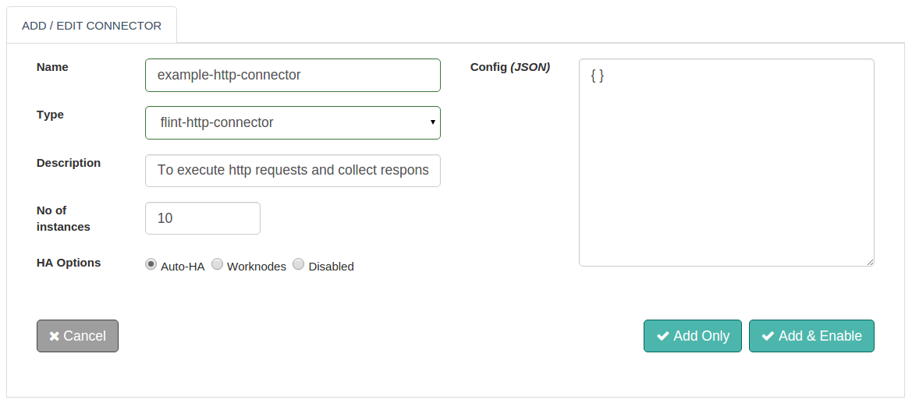

With Flint's HTTP Connector, we can send HTTP requests and read HTTP responses efficiently.

With this document, we will be able to use and work with the HTTP Connector.

##Features
+ Based on standardized HTTP protocol versions 1.0 and 1.1
+ HTTP methods - GET, POST, PUT, DELETE, HEAD & PATCH
+ Direct access to the response body and headers sent by the server
+ Efficiently read through the response body
+ Ability to set timeouts for connector execution
+ Synchronous / Asynchronous execution of the Connector

## Connector Configuration

No additional configuration is required for HTTP connector



## Actions

#### GET
Retrieve information from the given server using a given URI.

##### Request parameters
| Parameter | Description | Required |
| ------ | ----------- |
| connector_name | Name of the HTTP Connector to be configured. | true |
| method | Http Request Methods: GET | true |
| url | URL to be queried | true |
| headers | HTTP Request headers holding information about the http request to be made specified in key-value pairs in string format. Multiple headers must be separated by comma ( , ) | false |
| timeout | Timeout in milliseconds, taken by the connector to serve the http request. Default timeout is 60,000 ms | false |


##### Response parameters
| Parameter | Description  |
| ------ | ----------- |
| body | HTTP Response body sent by the server: text, text/plain, application/json, application/javascript, application/xml, text/xml|
| headers | HTTP Response headers holding information about the http response received. |

##### Example
``` ruby
response=@call.connector("my-http-connector")
              .set("method","GET")
              .set("url","http://httpbin.org/get")
              .set("headers","Cache-Control: no-cache")
              .set("timeout",10000)
              .sync

response_body=response.get("body")           #Response Body
response_headers=response.get("headers")     #Response Headers
```


#### POST
Send data to the server.

##### Request parameters
| Parameter | Description | Required |
| ------ | ----------- |
| connector_name | Name of the HTTP Connector to be configured. | true |
| method | Http Request Methods: POST | true |
| url | URL to be queried | true |
| body | HTTP Request body to be sent to the server. | true|
| headers | HTTP Request headers holding information about the http request to be made specified in key-value pairs in string format. Multiple headers must be separated by comma ( , ) | false |
| timeout | Timeout in milliseconds, taken by the connector to serve the http request. Default timeout is 60,000 ms | false |

##### Response parameters
| Parameter | Description  |
| ------ | ----------- |
| body | HTTP Response body sent by the server: text, text/plain, application/json, application/javascript, application/xml, text/xml|
| headers | HTTP Response headers holding information about the http response received. |

##### Example
``` ruby
response=@call.connector("my-http-connector")
              .set("method", "POST")
              .set("url", "http://httpbin.org/pos")
              .set("body","Welcome to Flint !!")
              .set("headers","Content-Type:text/plain, Authorization: b7d03a6947b217efb6f3ec3bd3504582")
              .set("timeout",10000)
              .sync
response_body=response.get("body")           #Response Body
response_headers=response.get("headers")     #Response Headers
```
#### PUT
Replaces all current representations of the target resource with the uploaded content.

##### Request parameters

| Parameter | Description | Required |
| ------ | ----------- |
| connector_name | Name of the HTTP Connector to be configured. | true |
| method | Http Request Methods: PUT | true |
| url | URL to be queried | true |
| body | HTTP Request body to be sent to the server. | true|
| headers | HTTP Request headers holding information about the http request to be made specified in key-value pairs in string format. Multiple headers must be separated by comma ( , ) | false |
| timeout | Timeout in milliseconds, taken by the connector to serve the http request. Default timeout is 60,000 ms | false |

##### Response parameters
| Parameter | Description  |
| ------ | ----------- |
| body | HTTP Response body sent by the server: text, text/plain, application/json, application/javascript, application/xml, text/xml|
| headers | HTTP Response headers holding information about the http response received. |

##### Example
``` ruby
response=@call.connector("my-http-connector")
         .set("method","PUT")
         .set("url","http://httpbin.org/put")
         .set("body","Have some suggestions for flint? We are listening !")
         .set("headers","Content-Type:text/plain, Authorization: b7d03a6947b217efb6f3ec3bd3504582")
         .set("timeout", 10000)
         .sync

response_body=response.get("body")           #Response Body
response_headers=response.get("headers")     #Response Headers
```

#### DELETE
Removes all current representations of the target resource given by a URI.

##### Request parameters

| Parameter | Description | Required |
| ------ | ----------- |
| connector_name | Name of the HTTP Connector to be configured. | true |
| method | Http Request Methods: DELETE | true |
| url | URL to be queried | true |
| body | HTTP Request body to be sent to the server. | false|
| headers | HTTP Request headers holding information about the http request to be made specified in key-value pairs in string format. Multiple headers must be separated by comma ( , ) | false |
| timeout | Timeout in milliseconds, taken by the connector to serve the http request. Default timeout is 60,000 ms | false |

##### Response parameters
| Parameter | Description  |
| ------ | ----------- |
| body | HTTP Response body sent by the server: text, text/plain, application/json, application/javascript, application/xml, text/xml|
| headers | HTTP Response headers holding information about the http response received. |

##### Example

``` ruby
response=@call.connector("my-http-connector")
              .set("method", "DELETE")
              .set("url", "http://httpbin.org/delete")
              .set("body", "Old age way of automating processes !")
              .set("headers", "Content-Type:text/plain, Authorization: b7d03a6947b217efb6f3ec3bd3504582")
              .set("timeout", 10000)
              .sync
response_body=response.get("body")           #Response Body
response_headers=response.get("headers")     #Response Headers
```

## Connector request error handling
Here is how you can handle the connector requests success or failures within your Flintbit. This would help you to take appropriate action if something failed.
``` ruby
if response.exitcode == 0               # 0 is success.
  puts "success"
  # take action in case of success
else                                    # non zero means fail
  puts "fail"
  puts "Reason:" + response.message     # get the reason of failure
  ## Take action in case of failure
end

```
