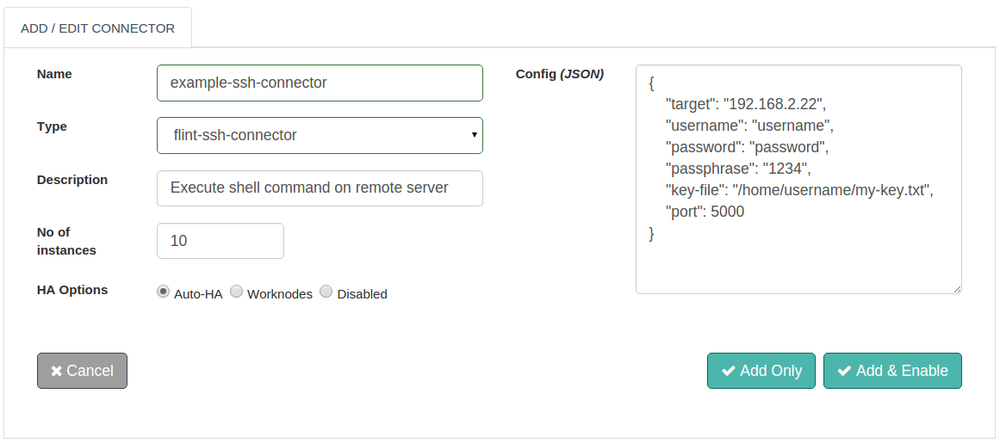

## SSH Connector

With Flint's SSH Connector you can execute commands on remote server machine using SSH2 Protocol.

With this document guide you will be able to work with and use a SSH Connector. While you start configuring the connector, this document will guide you through SSH Connector request and response parameters.

##Design Aspects
+ Based on Standardized SSH2 Protocol
+ Password based authentication mechanism
+ SSH Key based authentication mechanism ( with or without passphrase )
+ Series of commands to be executed specified in simplified comma separated format
+ Shell Command Execution Types: shell and exec
+ Direct access to the command execution results from the remote server machine
+ The ability to set Connector execution timeouts
+ Synchronous / Asynchronous execution of the Connector

## Add file connector



##### Configuration parameters
| Parameter | Description | Required |
| ------ | ----------- |
| target | Host name or ip-address of the remote machine you wish to connect to | true: config/request |
| username | Username which will be used to log into remote machine, required for authentication | true: config/request|
| password | Password associated with the username specified, required for authentication | false: config/request |
| passphrase | Passphrase that needs to be added to the SSH key | false: config/request |
| port | Port to connect to on the remote machine. Default value is 22 | false: config/request |
| key-file | Absolute file path including file name where the SSH key needs to be saved | false: config/request |

##### Example
``` json
{
  "target": "192.168.2.64",
  "username": "daniel",
  "password": "daniel123",
  "passphrase": "1234",
  "key-file": "/home/daniel/filename.pem",
  "port": "5000"
}
```

## Actions
#### Password based Authentication
Password based authentication mechanism

##### Request parameters
| Parameter | Description | Required |
| ------ | ----------- |
| connector_name | Name of the SSH Connector to be configured | true |
| target | Host name or ip-address of the remote machine you wish to connect to | true |
| username | Username which will be used to log into remote machine, required for authentication | true |
| password | Password associated with the username specified, required for authentication | true |
| command | Command to be executed on the host server machine | true |
| type | Shell execution is of two types - shell and exec.<ul><li>**exec** each command will be executed in a separate session as if the command is executed in new command shell</li><li>**shell** each command will be executed in the same session as if the command is executed in the same command shell</li></ul> Default execution type is **exec**. | false |
| timeout | Timeout in milliseconds, taken by the connector to serve the ssh request. Default timeout is 60,000 ms | false |


##### Response parameters
| Parameter | Description | Required |
| ------ | ----------- |
| result | Results as per the command executed | true |


##### Example
``` ruby
response=@call.connector("my-ssh-connector")
              .set("target","192.168.2.64")
              .set("username","daniel")
              .set("password","daniel123")
              .set("command","pwd")
              .set("timeout",1000)
              .sync

#SSH Connector Response Parameters
result=response.get("result")                    #Result
```


#### SSH key based authentication without Passphrase
SSH Key based authentication mechanism without passphrase.

##### Request parameters
| Parameter | Description | Required |
| ------ | ----------- |
| connector_name | Name of the SSH Connector to be configured | true |
| target | Host name or ip-address of the remote machine you wish to connect to | true |
| username | Username which will be used to log into remote machine, required for authentication | true |
| key-file | Absolute file path including file name where the SSH key needs to be saved and resides on local | true |
| command | Command to be executed on the host server machine | true |
| type | Shell execution is of two types - shell and exec.<ul><li>**exec** each command will be executed in a separate session as if the command is executed in new command shell</li><li>**shell** each command will be executed in the same session as if the command is executed in the same command shell</li></ul> Default execution type is **exec**. | false |
| timeout | Timeout in milliseconds, taken by the connector to serve the ssh request. Default timeout is 60,000 ms | false |


##### Response parameters
| Parameter | Description | Required |
| ------ | ----------- |
| result | Results as per the command executed | true |

##### Example
``` ruby
response=@call.connector("my-ssh-connector")
              .set("target","192.168.2.64")
              .set("username","daniel")
              .set("key-file":"/home/daniel/filename.pem")
              .set("command","pwd")
              .set("timeout",1000)
              .sync

#SSH Connector Response Parameters
result=response.get("result")                    #Result

```
#### SSH key based authentication with Passphrase
SSH Key based authentication mechanism with passphrase.

##### Request parameters
| Parameter | Description | Required |
| ------ | ----------- |
| connector_name | Name of the SSH Connector to be configured | true |
| target | Host name or ip-address of the remote machine you wish to connect to | true |
| username | Username which will be used to log into remote machine, required for authentication | true |
| passphrase | Passphrase to be added to the key-file | true |
| key-file | Absolute file path including file name where the SSH key needs to be saved and resides on local| true |
| command | Command to be executed on the host server machine | true |
| type | Shell execution is of two types - shell and exec.<ul><li>**exec** each command will be executed in a separate session as if the command is executed in new command shell</li><li>**shell** each command will be executed in the same session as if the command is executed in the same command shell</li></ul> Default execution type is **exec**. | false |
| timeout | Timeout in milliseconds, taken by the connector to serve the ssh request. Default timeout is 60,000 ms | false |


##### Response parameters
| Parameter | Description | Required |
| ------ | ----------- |
| result | Results as per the command executed | true |

##### Example
``` ruby
response=@call.connector("my-ssh-connector")
              .set("target","192.168.2.64")
              .set("username","daniel")
              .set("passphrase", "daniel123")
              .set("key-file":"/home/daniel/filename.pem")
              .set("command","pwd")
              .set("timeout",1000)
              .sync

#SSH Connector Response Parameters
result=response.get("result")                    #Result

```


## Connector request error check
Here is how to interpret connector response.
``` ruby
if response.exitcode == 0               # 0 is success.
  puts "success"
  # take action in case of success
else                                    # non zero means fail
  puts "fail"
  puts "Reason:" + response.message     # get the reason of failure
  ## Take action in case of failure
end

```
