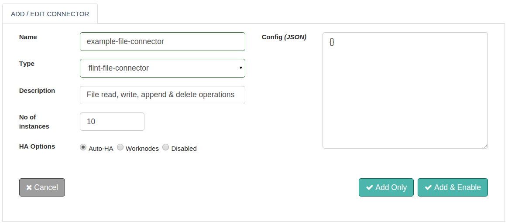

## File Connector

With Flint's File Connector you can perform read, write, append and delete operations on a file.

With this document guide you will be able to work with and use a File Connector.While you start configuring the connector, this document will guide you through File Connector request and response parameters.


## Configuring file connector
No additional configuration is required for file connector



## Actions

### read
Read a file form local file system

##### Request parameters
| Parameter | Description | required |
| ------ | ----------- |
| action | action to perform: read | true |
| file | Path of file to read | true |

##### Response parameters
| Parameter | Description | required |
| ------ | ----------- |
| body | Response Body, data read from the file | true |
| file | Path of file to read | true |

##### Example
``` ruby
response = @call.connector("file_connecor_name")
                .set("action","read")
                .set("file","/path/of/file/to/read")
                .sync

response_file = response.get("file")  #File read
file_content = response.get("body")  #Response Body, data read from the file
```


### write
Write content to file

##### Request parameters
| Parameter | Description | required |
| ------ | ----------- |
| action | action to perform: write | true |
| file | Path of file to write | true |
| data | data to be written to the file | true |

##### Example
``` ruby
response = @call.connector("file_connecor_name")
                .set("action","write")
                .set("file","/file/to/write")
                .set("data","some data to write")
                .sync

```
### append
Append content to file

##### Request parameters

| Parameter | Description | required |
| ------ | ----------- |
| action | action to perform: append | true |
| file | Path of file to append | true |
| data | data to be appended to the file | true |

##### Example
``` ruby
response = @call.connector("file_connecor_name")
                .set("action","append")
                .set("file","/file/to/append")
                .set("data","some data to append")
                .sync

```

### delete
Delete a file

##### Request parameters

| Parameter | Description | required |
| ------ | ----------- |
| action | action to perform: delete | true |
| file | Path of file to delete | true |

##### Example
``` ruby
response = @call.connector("file_connecor_name")
                .set("action","delete")
                .set("file","/file/to/delete")
                .sync

```

## Connector response
Here is how to interpret connector response.
``` ruby
if response.exitcode == 0               # 0 is success.
  puts "success"
  # take action in case of success
else                                    # non zero means fail
  puts "fail"
  puts "Reason:" + response.message     # get the reason of failure
  ## Take action in case of failure
end

```
