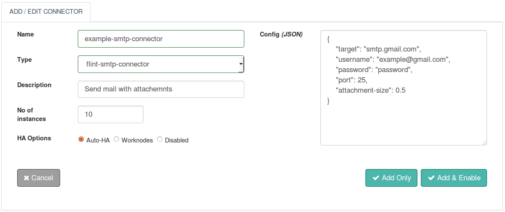

The SMTP connector is used to send email messages through a configured SMTP server.

With this document guide you will be able to work with and use a SMTP Connector.

## Features
+ Based on Standardized SMTP Protocol
+ Secure/Non-encrypted SMTP Server
+ Email message to multiple recipients
+ Multiple attachments possible along with the email-body
+ Attachments can be of the type .doc, .html, .odt, .xls and many more
+ An attachment of maximum 10 Mb size possible
+ Email body's can be of the types text/html, text/plain, multipart/alternative etc
+ Carbon Copy and Blind Carbon Copy options available
+ The ability to set Connector execution timeouts
+ Synchronous/Asynchronous execution of the Connector

## Connector Configuration



##### Configuration parameters
| Parameter | Description | Required |
| ------ | ----------- |
| target | Host name or IP address of the SMTP server | true |
| username | Username is the full email address of the sender's email account | false: config/request |
| password | Password associated with the sender's email account | true: config/request  |
| port | Port number on which the SMTP server is listening. Default port is **25** | false: config/request  |
| attachment_size | Size of the file to be attached to an email message. A file of maximum **10 Mb** size can be attached | false |

##### Example
```json
{
  "target": "smtp.gmail.com",
  "username": "example@gmail.com",
  "password": "example123",
  "post": 25,
  "attachment_size": 0.5
}
```
## Actions

### send
Send an email

##### Request parameters
| Parameter | Description | required |
| ------ | ----------- |
| action | Specify action as “send” for sending an email message |	true |
| to | Username is the full email address of the sender's email account| true |
| from |	Usernames of email accounts for whom the email message is meant | true |
| subject	| Specify subject of an email message here|	true |
| body | Email message content mainly a text | true |
| username | Username is the full email address of the sender's email account. Not required, if already specified in configuration file |	false |
| password	| Password associated with the sender's email account. Not required, if already specified in configuration file. |	false |
| port | Port number on which the SMTP server is listening. Default port is **25** | false |
| cc | Usernames of email accounts who need to be kept informed of the email message content, but no actions required from them. Multiple usernames must be given within an array of strings | false |
| bcc |	Usernames of email accounts you don't wish the other recipients to see that you sent it to this contact. Multiple usernames must be given within an array of strings | false |
| attachments |	Files to be attached to an email message. Maximum size of a file that can be attached is 10 Mb. Multiple file names must be given within an array of strings |	false |
| content-type |	Content-type of the email body. Example : text/plain, multipart/alternative etc. Default content-type is **text/html** | false |

##### Response parameters
| Parameter | Description | required |
| ------ | ----------- |
|result	| Message stating the status of mail delivery| true |


##### Example
``` ruby
response=@call.connector("my-smtp-connector")
              .set("action", "send" )
              .set("from", "email_test@gmail.com")
              .set("username", "email_test@gmail.com")
              .set("password", "example123")
              .set("to", [ "suzan_bones@gmail.com" , "kelly_90@gmail.com" ])
              .set("subject", "Testing Flint's SMTP Connector")
              .set("body","Hi, this is a test mail")
              .set("cc", [ "richard_133@gmail.com" , "caroline_9090@gmail.com" ])
              .set("bcc", [ "henry_clark@gmail.com" , "allen_jones@gmail.com"])
              .set("attachments", [ "Sample.txt" , "Example.doc" ])
              .set("content-type", "text/plain")
              .set("port" : 465)
              .sync

#SMTP Connector Response Parameters
result=response.get("result")                    #Result
```


## Connector request error handling
This is how success or failures can be handled for the connector requests within your Flintbit. This would help to take appropriate action if something failed.
``` ruby
if response.exitcode == 0               # 0 is success.
  puts "success"
  # take action in case of success
else                                    # non zero means fail
  puts "fail"
  puts "Reason:" + response.message     # get the reason of failure
  ## Take action in case of failure
end

```
