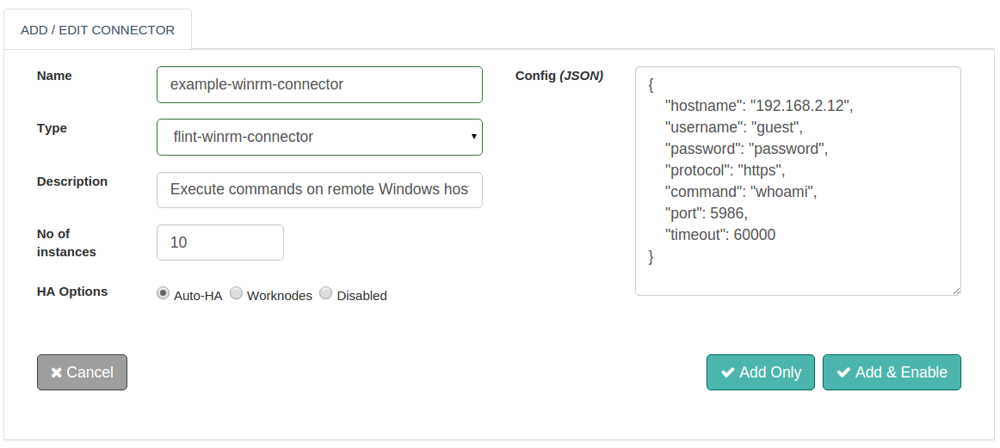

WinRM (Windows Remote Management) Connector can be used to execute commands on remote Windows server machine using Microsoft implementation of WS-Management Protocol.

## Features
+ Based on standardized Microsoft implementation of WS-Management protocol
+ Password based authentication mechanism
+ Both HTTP and HTTPS protocol support
+ Direct access to the command execution results from the remote server
+ The ability to set connector execution timeouts
+ Synchronous/Asynchronous execution of the connector

## Connector Configuration



##### Configuration parameters

| Parameter | Description | Required |
| ------ | ----------- |
| hostname | Host name or ip-address of the host server machine to connect | true: config/request |
| username | Connect with specified username, host server machine authentication | true: config/request |
| password | Connect with specified password, host server machine authentication | true: config/request |
| protocol | Connect with specified protocol, host server machine authentication. Default protocol is **http** | false: config/request |
| command | Command to be executed on the host server machine | true: config/request |
| port | Port to connect to the host server machine. Default port is **5985** | false: config/request |
| timeout | Execution time of the Command in milliseconds. Default timeout is **60000 milliseconds** | false: config/request |

##### Example

```json
{
  "hostname": "smtp.gmail.com",
  "username": "example@gmail.com",
  "password": "example123",
  "protocol": "https",
  "command": "whoami",
  "post": 5986,
  "timeout": 60000
}
```
## Actions

### [command]
Execute commands on Remote Windows Server

##### Request parameters

| Parameter | Description | required |
| ------ | ----------- |
| connector-name | Name of the WinRM Connector to be configured  | true|
| hostname | Host name or ip-address of the host server machine to connect  | true |
| username | Connect with specified username, host server machine authentication  | true |
| password | Connect with specified password, host server machine authentication  | true |
| protocol | Connect with specified protocol, host server machine authentication. Default protocol is **http**  | false |
| command | Command to be executed on the host server machine  | true |
| port | Port to connect to on the host server machine. Default port is **5985**  | false |
| timeout | Execution time of the Command in milliseconds. Default timeout is **60000 milliseconds**  | false |

##### Response parameters

| Parameter | Description | required |
| ------ | ----------- |
|output	| Output results as per the command executed | true |
|exit-status	| Exit status of the command executed | true |
|error	| Error results as per the command executed | true |


##### Example

``` ruby
response=@call.connector("my-winrm-connector")
              .set("hostname","192.168.2.64")
              .set("username","daniel")
              .set("password","daniel123")
              .set("protocol","http")
              .set("command","whoami")
              .set("port", 5986)
              .set("timeout",1000)
              .sync

#WinRM Connector Response Parameters
result=response.get("output")                    #Output
result=response.get("exit-status")               #Exit status
result=response.get("error")                     #Error output

```

## Connector request error handling

This is how success or failures can be handled for the connector requests within your Flintbit. This would help to take appropriate action if something failed.

``` ruby
if response.exitcode == 0               # 0 is success.
  puts "success"
  # take action in case of success
else                                    # non zero means fail
  puts "fail"
  puts "Reason:" + response.message     # get the reason of failure
  ## Take action in case of failure
end

```
