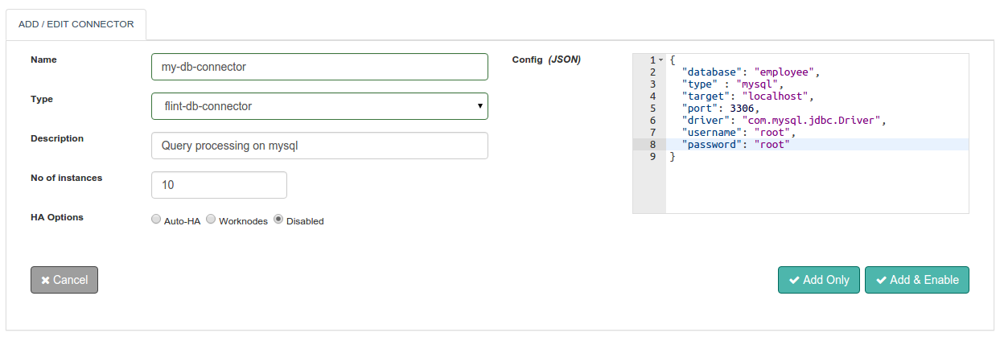

## JDBC Connector

With Flint's DB Connector you can execute queries against the mostly used databases in any IT infrastructure.

With this document guide you will be able to work with and use a DB Connector.

## Features
+ Query all popular databases : MySQL, MS SQL, Oracle and PostgreSQL
+ Simple DB queries : select, insert, update, delete and procedure
+ Databases with/without passwords accessible
+ Direct access to the query execution results from the remote server machine
+ Ability to set Connector execution timeout
+ Synchronous / Asynchronous execution of the Connector

## Connector Configuration




##### Configuration parameters
| Parameter | Description | Required |
| -------- | ------------ |
| database | The data source. Name of the database on which actions have to be performed | true: config/requrest |
| type | Type of Database. Valid types : mysql, postgresql, ms sql and oracle | true: config/request |
| target | Host name or IP address of the server on which the database resides | true: config/request |
| port | Port number on which the target server is listening | true: config/request |
| driver | Name of the driver depending on the type of database specified. For example : for a database type of mysql the driver name is com.mysql.jdbc.Driver | true: config/request |
| username | Username associated with the database. Not required, if already specified in connector configuration | true: config/request |
| password | Password associated with the database. Not required, if already specified in connector configuration | true: config/request |
| jdbc-url | Used to point to the database to which you wish to connect. URL convention followed :type:target:port/database. Example : jdbc:mysqllocalhost:3306/employee. After specifying the value for this parameter you can skip providing values for target, port, database and type | true: config/request |

## Example
``` json
{
  "database": "employee",
  "type" : "mysql",
  "target": "localhost",
  "port": 3306,
  "driver": "com.mysql.jdbc.Driver",
  "username": "root",
  "password": "root",
  "jdbc-url": "jdbc:mysqllocalhost:3306/employee"
}
```

## Actions

### select
Retrieving data from the database.

##### Request parameters

| Parameter | Description | required |
| ------ | ----------- |
| action | Operations to be performed on the data stored in database. Valid actions : select, insert, update, delete and procedure | true |
| database | Basically, is the data source. Name of the database on which actions have to be performed. Not required, if already specified in connector configuration. If specified will overwrite the one given in connector configuration | true |
| target |Host name or IP address of the server on which the database resides |true |
| driver |Specify the query that you want to performed on the database | true |
| type |Type of Database. Valid types : mysql, postgresql, ms sql and oracle. Not required, if already specified in connector configuration. If specified will overwrite the one given in connector configuration | true |
| port |Port number on which the target server is listening. Not required, if already specified in connector configuration. If specified will overwrite the one given in connector configuration | true |
| query | Name of the driver depending on the type of database specified. For example : for a database type of mysql the driver name is com.mysql.jdbc.Driver. Not required, if already specified in connector configuration. If specified will overwrite the one given in connector configuration | true |
| username | Username associated with the database. Not required, if already specified in connector configuration. If specified will overwrite the one given in connector configuration  | true |
| password |Password associated with the database. Not required, if already specified in connector configuration. If specified will overwrite the one given in connector configuration | true |

##### Response parameters

| Parameter | Description | required |
| ------ | ----------- |
| result | Results as per the query performed on the database. Will reflect the number of rows in database affected in case of insert,delete and update actions. In case of select action, the data retrieved will be displayed in an array format. The result for a procedure action is based on the type of query performed | true |

##### Example
``` ruby
response=@call.connector("my-db-connector")
              .set("action","select" )
              .set("database","employees")
              .set("type","mysql")
              .set("target","db.example.com")
              .set("port",3306)
              .set("driver", "com.mysql.jdbc.Driver")
              .set("query", "select * from employee")
              .sync

#DB Connector Response Parameters
result=response.get("result") #Query execution results
```


### Insert
Inserting data into the database

##### Request parameters
| Parameter | Description | required |
| ------ | ----------- |
| action | Operations to be performed on the data stored in database. Valid actions : select, insert, update, delete and procedure | true |
| jdbc-url | Used to point to the database to which you wish to connect. URL convention followed :type:target:port/database. Example : jdbc:mysqllocalhost:3306/employee. After specifying the value for this parameter you can skip providing values for target, port, database and type | true |
| query | Name of the driver depending on the type of database specified. For example : for a database type of mysql the driver name is com.mysql.jdbc.Driver. Not required, if already specified in connector configuration. If specified will overwrite the one given in connector configuration | true |
| driver |Specify the query that you want to performed on the database | true |

##### Response parameters

| Parameter | Description | required |
| ------ | ----------- |
| result | Results as per the query performed on the database. Will reflect the number of rows in database affected in case of insert,delete and update actions. In case of select action, the data retrieved will be displayed in an array format. The result for a procedure action is based on the type of query performed | true |

##### Example
``` ruby
response=@call.connector("my-db-connector")
              .set("action","insert" )
              .set("jdbc-url" : "jdbc:mysql://db.example.com:3306/my-employess")
              .set("driver", "com.mysql.jdbc.Driver")
              .set("query", "insert into employee (age,lastname,city) values(27,'kennedy','pune')")
              .sync

#DB Connector Response Parameters
result=response.get("result") #Query execution results

```
### update
Updating data from the database

##### Request parameters
| Parameter | Description | required |
| ------ | ----------- |
| action | Operations to be performed on the data stored in database. Valid actions : select, insert, update, delete and procedure | true |
| jdbc-url | Used to point to the database to which you wish to connect. URL convention followed :type:target:port/database. Example : jdbc:mysqllocalhost:3306/employee. After specifying the value for this parameter you can skip providing values for target, port, database and type | true |
| query | Name of the driver depending on the type of database specified. For example : for a database type of mysql the driver name is com.mysql.jdbc.Driver. Not required, if already specified in connector configuration. If specified will overwrite the one given in connector configuration | true |
| driver |Specify the query that you want to performed on the database | true |


##### Response parameters

| Parameter | Description | required |
| ------ | ----------- |
| result | Results as per the query performed on the database. Will reflect the number of rows in database affected in case of insert,delete and update actions. In case of select action, the data retrieved will be displayed in an array format. The result for a procedure action is based on the type of query performed | true |

##### Example
``` ruby
response=@call.connector("my-db-connector")
              .set("action","update" )
              .set("jdbc-url" : "jdbc:mysql://db.example.com:3306/my-employess")
              .set("driver", "com.mysql.jdbc.Driver")
              .set("query", "update employee set lastname='subhramanyam',city='delhi' where age = 27")
              .sync

#DB Connector Response Parameters
result=response.get("result") #Query execution results

```

### delete
deleting data from the database

##### Request parameters
| Parameter | Description | required |
| ------ | ----------- |
| action | Operations to be performed on the data stored in database. Valid actions : select, insert, update, delete and procedure | true |
| jdbc-url | Used to point to the database to which you wish to connect. URL convention followed :type:target:port/database. Example : jdbc:mysqllocalhost:3306/employee. After specifying the value for this parameter you can skip providing values for target, port, database and type | true |
| query | Name of the driver depending on the type of database specified. For example : for a database type of mysql the driver name is com.mysql.jdbc.Driver. Not required, if already specified in connector configuration. If specified will overwrite the one given in connector configuration | true |
| driver |Specify the query that you want to performed on the database | true |


##### Response parameters

| Parameter | Description | required |
| ------ | ----------- |
| result | Results as per the query performed on the database. Will reflect the number of rows in database affected in case of insert,delete and update actions. In case of select action, the data retrieved will be displayed in an array format. The result for a procedure action is based on the type of query performed | true |

##### Example
``` ruby
response=@call.connector("my-db-connector")
              .set("action","delete" )
              .set("jdbc-url" : "jdbc:mysql://db.example.com:3306/my-employess")
              .set("driver", "com.mysql.jdbc.Driver")
              .set("query", "delete from employee where age=27")
              .sync

#DB Connector Response Parameters
result=response.get("result") #Query execution results

```
### procedure
call procedure/function

##### Request parameters
| Parameter | Description | required |
| ------ | ----------- |
| action | Operations to be performed on the data stored in database. Valid actions : select, insert, update, delete and procedure | true |
| jdbc-url | Used to point to the database to which you wish to connect. URL convention followed :type:target:port/database. Example : jdbc:mysqllocalhost:3306/employee. After specifying the value for this parameter you can skip providing values for target, port, database and type | true |
| query | Name of the driver depending on the type of database specified. For example : for a database type of mysql the driver name is com.mysql.jdbc.Driver. Not required, if already specified in connector configuration. If specified will overwrite the one given in connector configuration | true |
| driver |Specify the query that you want to performed on the database | true |


##### Response parameters

| Parameter | Description | required |
| ------ | ----------- |
| result | Results as per the query performed on the database. Will reflect the number of rows in database affected in case of insert,delete and update actions. In case of select action, the data retrieved will be displayed in an array format. The result for a procedure action is based on the type of query performed | true |

##### Example
``` ruby
response=@call.connector("my-db-connector")
              .set("action","procedure" )
              .set("jdbc-url" : "jdbc:mysql://db.example.com:3306/my-employess")
              .set("driver", "com.mysql.jdbc.Driver")
              .set("query", "call simple()")
              .sync

#DB Connector Response Parameters
result=response.get("result") #Query execution results

```

## Connector request error handling
Here is how you can handle the connector requests success or failures within your Flintbit. This would help you to take appropriate action if something failed.

``` ruby
if response.exitcode == 0               # 0 is success.
  puts "success"
  # take action in case of success
else                                    # non zero means fail
  puts "fail"
  puts "Reason:" + response.message     # get the reason of failure
  ## Take action in case of failure
end

```
