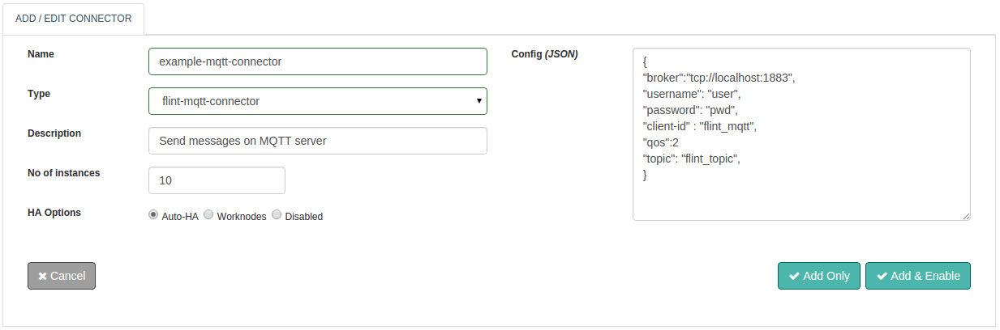
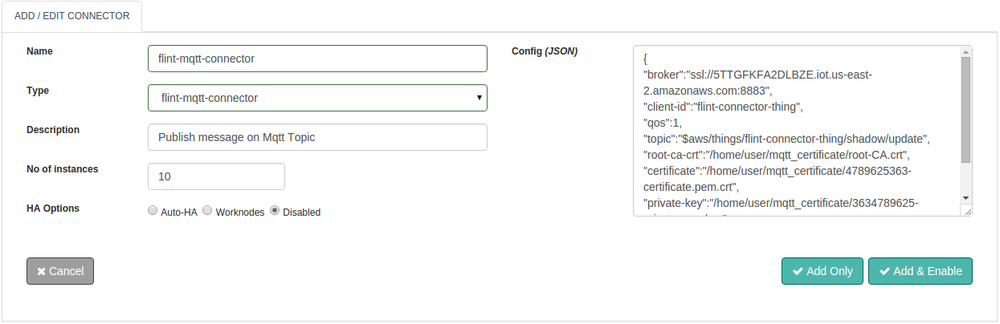

MQTT is a machine-to-machine (M2M)/"Internet of Things" connectivity protocol. It was designed as an extremely lightweight publish/subscribe messaging transport. It is useful for connections with remote locations where a small code footprint is required and/or network bandwidth is at a premium.

With Flint's MQTT Connector you can send message on local/remote MQTT server machine using MQTT Protocol. You can configure your connector with Flint's MQTT Connector to suite your special demands without the need to extend or replace any inbuilt code. After configuring, with your scripting skills Flint will automate the workflow.Thus without any compromise Performance, Stability and Flexibility all are packaged into Flint's MQTT Connector.

With this document guide you will be able to work with and use a MQTT Connector.While you start configuring the connector, this document will guide you through MQTT Connector request and response parameters.

## Features
+ Based on Standardized MQTT Protocol
+ Ability to Configure with AWS IoT Thing.
+ Certificate Based authentication mechanism for AWS IoT Thing.
+ Extremely simple and lightweight messaging protocol
+ Password based authentication mechanism
+ MQTT Protocol used at “Internet of Things” world of connected devices.
+ The ability to set Connector execution timeouts
+ Synchronous / Asynchronous execution of the Connector


## Connector Configuration



##### Configuration parameters- config(JSON)
| Parameter | Description | Required |
| ------ | ----------- |
| broker | Broker specifies the address of a server that the client may connect. | true: config/request |
| username | Username to use for the connection to server | false: config/request|
| password | Password to use for the connection to server | false: config/request |
| client-id | A client identifier client-id, It must be unique across all clients connecting to the same server. | true: config/request |
| topic | Delivers a message to the server on topic | true: config/request |
| qos | Sets the quality of service for this message, default is 2. | false: config/request |


##### Example
``` json
{
  "broker": "tcp://localhost:1883",
  "username": "user",
  "password": "pwd",
  "client-id": "flint_mqtt",
  "qos": 2,
  "topic": "flint_topic"
}
```

## Connector Configuration for aws IoT



##### Configuration parameters for AWS IoT- config(JSON)
| Parameter | Description | Required |
| ------ | ----------- |
| broker | Broker specifies the address of a server that the client may connect. | true: config/request |
| client-id | A client identifier client-id, It must be unique across all clients connecting to the same server. | true: config/request |
| topic | Delivers a message to the server on topic | true: config/request |
| qos | Sets the quality of service for this message, default is 2. | true: config/request |
| root-ca-crt | Absolute file Path of root-CA.crt Certificate | false: config/Required when want to connect to AWS IoT Thing |
| certificate | Absolute file Path of x.509 Certificate | false: Required when want to connect to AWS IoT Thing |
| private-key | Absolute file Path of Private Key | false: Required when want to connect to AWS IoT Thing |
| use-certificate | Set it true when you want to authenticate using certificate files, otherwise set it false, Default value is false. | true:config/request |

##### Example for AWS IoT
``` json
{
  "broker": "ssl://Z2EBLEZ5JJFGKF.iot.us-east-1.amazonaws.com:8883",
  "client-id":"thing-name",
  "topic":"$aws/things/thing-name/shadow/update",
  "qos": 2,
  "root-ca-crt":"/home/user/mqtt_certificate/root-CA.crt",
  "certificate":"/home/user/mqtt_certificate/5363478962-certificate.pem.crt",
  "private-key":"/home/user/mqtt_certificate/5363478962-private.pem.key",
  "use-certificate":true
}
```


## Actions
### send
Send message on MQTT topic

##### Request parameters

| Parameter | Description | Required |
| ------ | ----------- |
| broker | Broker specifies the address of a server that the client may connect. | true: config/request |
| username | Username to use for the connection to server | false: config/request|
| password | Password to use for the connection to server | false: config/request |
| client-id | A client identifier client-id, It must be unique across all clients connecting to the same server. | true: config/request |
| topic | Delivers a message to the server on topic | true: config/request |
| qos | Sets the quality of service for this message, default is 2. | false: config/request |
| content | Message which we want to send on specified topic | true: config/request |
| root-ca-crt | Absolute file Path of root-CA.crt Certificate | false: config/Required when want to connect to AWS IoT Thing |
| certificate | Absolute file Path of x.509 Certificate | false: Required when want to connect to AWS IoT Thing |
| private-key | Absolute file Path of Private Key | false: Required when want to connect to AWS IoT Thing |
| use-certificate | Set it true when you want to authenticate using certificate files, otherwise set it false, Default value is false. | false:config/request |

##### Response parameters

| Parameter | Description | required |
| ------ | ----------- |
|meta |Meta-Data as per execution of the MQTT Connector. Exit-code and message are the two meta parameters | true |
|exit-code | Exit status code as per execution of the MQTT Connector| true |
|message	| Status message as per execution of the MQTT Connector | true |


##### Example

``` ruby
response=@call.connector("my-mqtt-connector")
                         .set("action","send")
                         .set("broker","tcp://localhost:1883")
                         .set("username","user")
                         .set("password","pwd")
                         .set("client-id","flint_client") 
                         .set("topic","flint_mqtt")
                         .set("qos",2)
                         .sync

#MQTT Connector Response Meta Parameters
response_exitcode=response.exitcode            #Exit status code
response_message=response.message              #Execution status messages

```

##### Example for AWS IoT

``` ruby
response=@call.connector("my-mqtt-connector")
				.set("action","send")
				.set("broker","ssl://Z2EBLEZ5JJFGKF.iot.us-east-1.amazonaws.com:8883")
				.set("root-ca-crt","/home/user/mqtt_certificate/root-CA.crt")
				.set("certificate","/home/user/mqtt_certificate/5363478962-certificate.pem.crt")
				.set("private-key","/home/user/mqtt_certificate/5363478962-private.pem.key")
				.set("client-id","thing-name") 
				.set("topic","$aws/things/thing-name/shadow/update")
				.set("qos",1)
				.set("content","{\"state\":{\"reported\":{\"color\":{\"r\":255,\"g\":255}}}}")
				.sync

#MQTT Connector Response Meta Parameters
response_exitcode=response.exitcode            #Exit status code
response_message=response.message              #Execution status messages

```

## Connector request error handling

This is how success or failures can be handled for the connector requests within your Flintbit. This would help to take appropriate action if something failed.

``` ruby
if response.exitcode == 0               # 0 is success.
  puts "success"
  # take action in case of success
else                                    # non zero means fail
  puts "fail"
  puts "Reason:" + response.message     # get the reason of failure
  ## Take action in case of failure
end

```
