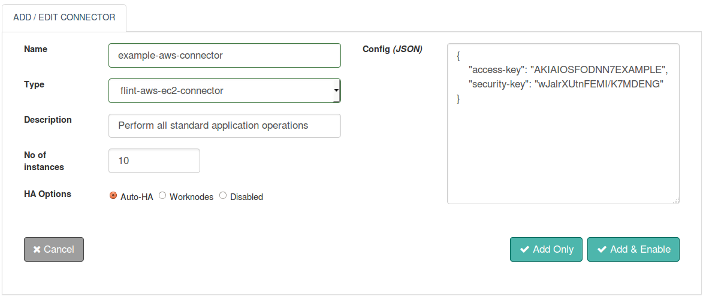

With Flint's AWS-EC2 Connector you can launch and manage server instances in Amazon data centers.

With this document, we will be able to use and work with the AWS-EC2 Connector.

##Design Aspects
+ Based on standardized HTTP protocol versions 1.0 and 1.1
+ HTTP methods - GET, POST, PUT, DELETE, HEAD & PATCH
+ Direct access to the response body and headers sent by the server
+ Efficiently read through the response body
+ Ability to set timeouts for connector execution
+ Synchronous / Asynchronous execution of the Connector

Perform all standard application operations like Instance, Security Group and Resource Tagging operations available through the Amazon EC2 web services. Some of them are listed below:

* Create instance, security groups and resource tags
* Describe instance, security groups and resource tags
* Delete instance, security groups and resource tags
* Stop instance
* Terminate instance
* Modify instance attributes
Also,

* The ability to set Connector execution timeouts
* Synchronous / Asynchronous execution of the Connector


## Connector Configuration



##### Configuration parameters
| Parameter | Description | Required |
| ------ | ----------- |
| access-key | Amazon Web Services account Access-key Credentials | true: config/request |
| security-key | Amazon Web Services account Security-key Credentials | true: config/request|

##### Example
``` json
{
  "access-key": "BQBIJKQHGTSQK3KL5SGQ",
  "security-key": "i2+pesMRCOayBq+qwe6Qo+wrn9eHKG9BIBSH0mev"
}
```

## Actions

#### Create Instance operation
Create Instance on AWS-EC2 from given details.

##### Request parameters
| Parameter | Description | Required |
| ------ | ----------- |
| connector_name | Name of the AWS-EC2 Connector to be configured. | true |
| action | Contains the name of the operation: create-instance | true |
| image-id | Specifies the unique ID for the AMI(Amazon Machine Images) | true |
| instance-type | Specifies the type of the instance Valid values are: m1.small, m1.large, m1.xlarge, c1.medium, c1.xlarge, m2.2xlarge, m2.4xlarge, t2.micro | true |
| min-instance | Specifies the minimum number of instances to launch, If Amazon EC2 cannot launch the value specified in the (min-count) element, no instances are launched. Valid values: Any value between 1 and the maximum number of instances allowed for your Amazon EC2 account | false |
| max-instance | Specifies the maximum number of instances to launch, If Amazon EC2 cannot launch the value specified in the (max-count) element, the largest possible number greater than that specified in the (min-count) element is launched. Valid values: Any value between 1 and the maximum number of instances allowed for your Amazon EC2 account | true |
| availability-zone | Specifies the placement constraints or availability zones for launching the required instances For example, us-east-1a is a sample value for the availability zone element. (Default: us-east-1a) | false |
| region | Specifies the region for performing operations on Amazon EC2 (Default value: us-east-1) | true |
| key-name | Specifies the name of the key pair | false |
| subnet-id | Specifies the subnet ID for the Amazon Virtual Private Cloud within which to launch the instance or instances | false |
| access-key | Specifies the credentials for signing the connector request | false |
| security-key | Specifies the credentials for signing the connector request | false |

##### Response parameters
| Parameter | Description  |
| ------ | ----------- |
| instance-info | Amazon EC2 created instance info set |

##### Example
``` ruby
response = @call.connector(connector_name)
                    .set("action",aws_action)
                    .set("image-id",aws_image_id)
                    .set("instance-type",aws_instance_type)
                    .set("min-instance",aws_min_instance)
                    .set("max-instance",aws_max_instance)
                    .set("region",aws_region)
                    .set("availability-zone",aws_availability_zone)
                    .set("key-name",aws_key_name)
                    .set("subnet-id",aws_subnet_id)
                    .set("security-key",aws_security_key)
                    .set("access-key",aws_access_key)
                    .timeout(request_timeout)
                    .sync

#Amazon EC2 Connector Response Meta Parameters
response_exitcode = response.exitcode                   #Exit status code
response_message = response.message                     #Execution status messages
 
#Amazon EC2 Connector Response Parameters
instance_info = response.get("instance-info")           #Amazon EC2 created instance info set
 
  instance_info.each do |instance|
      @log.info("Amazon EC2 Instance ID : #{instance.get("instance-id")} | 
                            Instance Type : #{instance.get("instance-type")} |
                            Instance public IP : #{instance.get("public-ip")} |
                            Instance private IP : #{instance.get("private-ip")} ") 
  end
```

#### Start Instance operation
Start Instance on AWS-EC2 from given details.

##### Request parameters
| Parameter | Description | Required |
| ------ | ----------- |
| connector_name | Name of the AWS-EC2 Connector to be configured. | true |
| action | Contains the name of the operation: start-instances | true |
| instance-id | Contains one or more instance IDs corresponding to the instances that you want to start, supplied within an array of strings | true  |
| region | Specifies the region for performing operations on Amazon EC2 (Default value: us-east-1) | true |
| access-key | Specifies the credentials for signing the connector request | false |
| security-key | Specifies the credentials for signing the connector request | false |

##### Response parameters
| Parameter | Description  |
| ------ | ----------- |
| started-instances-set | Amazon EC2 started instance info set |

##### Example
``` ruby
response = @call.connector(aws_connector_name)
                    .set("action",aws_action)
                    .set("instance_id",aws_instance_id)
                    .set("region",aws_region)
                    .set("security-key",aws_security_key)
                    .set("access-key",aws_access_key)
                    .timeout(request_timeout)
                    .sync

#Amazon EC2 Connector Response Meta Parameters
response_exitcode = response.exitcode                #Exit status code
response_message = response.message                  #Execution status messages
 
#Amazon EC2 Connector Response Parameters
instances_set=response.get("started-instances-set")  #Set of Amazon EC2 started instances
 
  instances_set.each do |instance_id|
       @log.info("Amazon EC2 Instance current state : #{instance_id.get("current-state")} |
                             previous state : #{instance_id.get("previous-state")} |
                             Instance id : #{instance_id.get("instance-id")}")
  end
  

```

#### Stop Instance operation
Stop Instance on AWS-EC2 from given details.

##### Request parameters
| Parameter | Description | Required |
| ------ | ----------- |
| connector_name | Name of the AWS-EC2 Connector to be configured. | true |
| action | Contains the name of the operation: stop-instances | true |
| instance-id | Contains one or more instance IDs corresponding to the instances that you want to stop, supplied within an array of strings | true  |
| region | Specifies the region for performing operations on Amazon EC2 (Default value: us-east-1) | true |
| access-key | Specifies the credentials for signing the connector request | false |
| security-key | Specifies the credentials for signing the connector request | false |

##### Response parameters
| Parameter | Description  |
| ------ | ----------- |
| stop-instance-list | Amazon EC2 stopped instance info set |

##### Example
``` ruby
response = @call.connector(aws_connector_name)
                    .set("action",aws_action)
                    .set("instance_id",aws_instance_id)
                    .set("region",aws_region)
                    .set("security-key",aws_security_key)
                    .set("access-key",aws_access_key)
                    .timeout(request_timeout)
                    .sync

#Amazon EC2 Connector Response Meta Parameters
response_exitcode = response.exitcode               #Exit status code
response_message = response.message                 #Execution status messages
 
#Amazon EC2 Connector Response Parameters
instances_set=response.get("stop-instance-list")    #Set of Amazon EC2 stopped instances
 
instances_set.each do |instance_id|
   @log.info("Amazon EC2 Instance current state : #{instance_id.get("current-state")} |
                         previous state : #{instance_id.get("previous-state")} |
                         Instance ID : #{instance_id.get("instance-id")}")
 end
 
```

#### Terminate Instance operation
Terminate Instance on AWS-EC2 from given details.

##### Request parameters
| Parameter | Description | Required |
| ------ | ----------- |
| connector_name | Name of the AWS-EC2 Connector to be configured. | true |
| action | Contains the name of the operation: terminate-instances | true |
| instance-id | Contains one or more instance IDs corresponding to the instances that you want to terminate, supplied within an array of strings | true  |
| region | Specifies the region for performing operations on Amazon EC2 (Default value: us-east-1) | true |
| access-key | Specifies the credentials for signing the connector request | false |
| security-key | Specifies the credentials for signing the connector request | false |

##### Response parameters
| Parameter | Description  |
| ------ | ----------- |
| terminated-instance-set | Amazon EC2 terminated instance info set |

##### Example
``` ruby
response = @call.connector(aws_connector_name)
                    .set("action",aws_action)
                    .set("instance_id",aws_instance_id)
                    .set("region",aws_region)
                    .set("security-key",aws_security_key)
                    .set("access-key",aws_access_key)
                    .timeout(request_timeout)
                    .sync

#Amazon EC2 Connector Response Meta Parameters
response_exitcode = response.exitcode                    #Exit status code
response_message = response.message                      #Execution status messages
 
#Amazon EC2 Connector Response Parameters
instances_set = response.get("terminated-instance-set")  #Set of Amazon EC2 terminated instances
 
instances_set.each do |instance_id|
  @log.info("Amazon EC2 Instance current state :  #{instance_id.get("current-state")} |
                        previous state : #{instance_id.get("previous-state")}
                        Instance ID :    #{instance_id.get("instance-id")}")
end
```

#### Reboot Instance operation
Reboot Instance on AWS-EC2 from given details.

##### Request parameters
| Parameter | Description | Required |
| ------ | ----------- |
| connector_name | Name of the AWS-EC2 Connector to be configured. | true |
| action | Contains the name of the operation: reboot-instances | true |
| instance-id | Contains one or more instance IDs corresponding to the instances that you want to reboot, supplied within an array of strings | true  |
| region | Specifies the region for performing operations on Amazon EC2 (Default value: us-east-1) | true |
| access-key | Specifies the credentials for signing the connector request | false |
| security-key | Specifies the credentials for signing the connector request | false |

##### Response parameters
| Parameter | Description  |
| ------ | ----------- |
| reboot-instance-id | Amazon EC2 rebooted instance info set |

##### Example
``` ruby
response = @call.connector(aws_connector_name)
                    .set("action",aws_action)
                    .set("instance_id",aws_instance_id)
                    .set("region",aws_region)
                    .set("security-key",aws_security_key)
                    .set("access-key",aws_access_key)
                    .timeout(request_timeout)
                    .sync
                    

#Amazon EC2 Connector Response Meta Parameters
response_exitcode = response.exitcode                   #Exit status code
response_message = response.message                     #Execution status messages
 
#Amazon EC2 Connector Response Parameters
instances_set=response.get("reboot-instance-id")        #Set of Amazon EC2 rebooted instances
 
    instances_set.each do |instance_id|
   @log.info("Amazon EC2 rebooted instance : #{instance_id.to_s}")
 end
 
```

#### Describe Instance operation
Describe Instance on AWS-EC2 from given details.

##### Request parameters
| Parameter | Description | Required |
| ------ | ----------- |
| connector_name | Name of the AWS-EC2 Connector to be configured. | true |
| action | Contains the name of the operation: describe-instances | true |
| instance-id | Contains one or more instance IDs corresponding to the instances that you want to describe, supplied within an array of strings | true  |
| region | Specifies the region for performing operations on Amazon EC2 (Default value: us-east-1) | true |
| access-key | Specifies the credentials for signing the connector request | false |
| security-key | Specifies the credentials for signing the connector request | false |

##### Response parameters
| Parameter | Description  |
| ------ | ----------- |
| reboot-instance-id | Amazon EC2 rebooted instance info set |

##### Example
``` ruby
response = @call.connector(aws_connector_name)
                    .set("action",aws_action)
                    .set("instance_id",aws_instance_id)
                    .set("region",aws_region)
                    .set("security-key",aws_security_key)
                    .set("access-key",aws_access_key)
                    .timeout(request_timeout)
                    .sync
                    

#Amazon EC2 Connector Response Meta Parameters
response_exitcode = response.exitcode                   #Exit status code
response_message = response.message                     #Execution status messages
instances_set = response.get("instances-info")           #Set of Amazon EC2 instances

instances_set.each do |instance|
	@log.info("Amazon EC2 instance image id :	#{instance.get("image-id")} |
								public ip :	#{instance.get("public-ip")} |
								instance type :	#{instance.get("instance-type")} |
								key-name :	#{instance.get("key-name")} |
								private ip :	#{instance.get("private-ip")} |
								hypervisor :	#{instance.get("hypervisor")} |
								kernel id :  #{instance.get("kernel-id")} |
								instance id :  #{instance.get("instance-id")} |
								architecture :  #{instance.get("architecture")} |
								client-token :  #{instance.get("client-token")} |
								instance-lifecycle :  #{instance.get("instance-lifecycle")} |
								platform :  #{instance.get("platform")} |
								state code :  #{instance.get("instance-state-code")} |
								state name :  #{instance.get("instance-state-name")} |
								ramdisk id :  #{instance.get("ramdisk-id")} |
								ebs optimized :  #{instance.get("ebs-optimized")} |
								placement tenancy :  #{instance.get("placement-tenancy")} |
								placement group name :  #{instance.get("placement-group-name")} |
								public DNS name :  #{instance.get("public-DNSname")} |
								root device name :  #{instance.get("root-device-name")} |
								root device type :  #{instance.get("root-device-type")} |
								launch time :  #{instance.get("launch-time")} |
								subnet id :  #{instance.get("subnet-id")} |
								virtualization type :  #{instance.get("virtualization-type")} |
								vpc id :  #{instance.get("vpc-id")} |
								ami launch index :  #{instance.get("ami-launch-index")} |")
end

```

## Connector request error handling
This is how success or failures can be handled for the connector requests within your Flintbit. This would help to take appropriate action if something failed.
``` ruby
if response.exitcode == 0               # 0 is success.
  puts "success"
  # take action in case of success
else                                    # non zero means fail
  puts "fail"
  puts "Reason:" + response.message     # get the reason of failure
  ## Take action in case of failure
end

```
