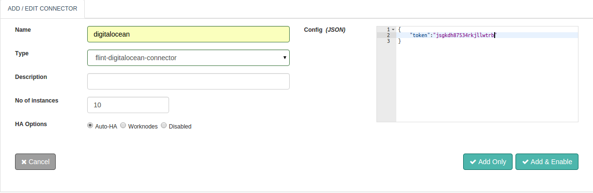

## DigitalOcean Connector

DigitalOcean is a cloud infrastructure provider focused on simplifying web infrastructure for software developers DigitalOcean’s servers use only high-performance Solid State Disks. Their speed directly benefits the performance of hosted web sites and applications. All DigitalOcean cloud servers are live and configurable in less than one minute.DigitalOcean’s command center makes configuring cloud servers and development frameworks simple and intuitive.DigitalOcean offers five popular Linux distributions that can be automatically pre-installed upon deployment of a server: Ubuntu, CentOS, Debian, Fedora, and CoreOS. FreeBSD is also supported.

With this document guide you will be able to work with and use a DigitalOcean Connector. While you start configuring the connector, this document will guide you through DigitalOcean Connector request and response parameters.

## Design Aspects
Perform all standard application operations like Create, Start and Stop operations available through the DigitalOcean Connector. Some of them are listed below:

+ List
+ Create
+ Start
+ Stop
+ Reboot
+ Reset
+ Details
+ Delete
+ Check action status
+ get region

Also,

The ability to set Connector execution timeouts
Synchronous / Asynchronous execution of the Connector


## Configuring DigitalOcean Connector



##### Configuration parameters

| Parameter | Description | required |
| ------ | ----------- |
| token | DigitalOcean client token | true: config/request |


##### Example
``` json
{
  "token" : "b7d03a6947b217efb6f3ec3bd3504582"
}

```

## Actions

### list
List all instances of DigitalOcean associated with provided token.

##### Request parameters
| Parameter | Description | required |
| ------ | ----------- |
| action | action to perform: list | true |
| token | DigitalOcean client token | true: config/request |


##### Response parameters
| Parameter | Description | required |
| ------ | ----------- |
| response | Response Body, list of all instances. | true |

##### Example
``` ruby
response = @call.connector("digitalocean_connector_name")
                  .set("action","list")
                  .set("token","b7d03a6947b217efb6f3ec3bd3504582")
                  .sync

ticket_content = response.get("response")  #Response Result, Array of droplets associated with provided token.
```

### create
Create a droplet on DigitalOcean.

##### Request parameters
| Parameter | Description | required |
| ------ | ----------- |
| action | action to perform: create | true |
| token | DigitalOcean client token | true: config/request |
| name | The human-readable string you wish to use when displaying the Droplet name.| true |
| region | The region where DigitalOcean Instance will be created. | true |
| size | The size of the DigitalOcean Instance | true |
| image |  The image id of the operating system which you want in your DigitalOcean Instance| true |
| ssh_keys | Array of SSH key that you wants to embed in droplet. | false |
| backups | Autometed backup should be enable or not | false |
| ipv6 | IPV6 enable or not | false |
| user_data | User data for the droplet | false |
| private_networking | Private networking enable or not | false |


##### Response parameters
| Parameter | Description | required |
| ------ | ----------- |
| response | Response Body, details related to newly created instance | true |

##### Example
``` ruby
response = @call.connector("digitalocean_connector_name")
                .set("action","create")
                .set("token","b7d03a6947b217efb6f3ec3bd3504582")
                .set("name","example.com")
                .set("region","nyc3")
                .set("size","512mb")
                .set("image","ubuntu-14-04-x64",
                .set("ssh_keys",null)
                .set("backups",false)
                .set("ipv6",false)
                .set("user_data","")
                .set("private_networking", true)
                .sync

ticket_content = response.get("response")  #Response Result, droplet details.
```
### start
Start droplet.

##### Request parameters

| Parameter | Description | required |
| ------ | ----------- |
| action | action to perform: start | true |
| token | DigitalOcean client token | true: config/request |
| id | Unique identifier of  droplet | true |

##### Response parameters
| Parameter | Description | required |
| ------ | ----------- |
| response | Response Body, Data related to action status performed on droplet i.e. start | true |

##### Example
``` ruby
response = @call.connector("digitalocean_connector_name")
                .set("action","start")
                .set("token","b7d03a6947b217efb6f3ec3bd3504582")
                .set("id", 3164450)
                .sync

ticket_content = response.get("response")  #Response Result, Action details.
```

### stop
Stop droplet.

##### Request parameters

| Parameter | Description | required |
| ------ | ----------- |
| action | action to perform: stop | true |
| token | DigitalOcean client token | true: config/request |
| id | Unique identifier of  droplet | true |

##### Response parameters
| Parameter | Description | required |
| ------ | ----------- |
| response | Response Body, Data related to issue | true |

##### Example
``` ruby
response = @call.connector("digitalocean_connector_name")
                .set("action","stop")
                .set("token","b7d03a6947b217efb6f3ec3bd3504582")
                .set("id", 3164450)
                .sync

ticket_content = response.get("response")  #Response Result, Action details.
```

### reboot
Reboot droplet.

##### Request parameters

| Parameter | Description | required |
| ------ | ----------- |
| action | action to perform: reboot | true |
| token | DigitalOcean client token | true: config/request |
| id | Unique identifier of  droplet | true |

##### Response parameters
| Parameter | Description | required |
| ------ | ----------- |
| response | Response Body, Data related to issue | true |

##### Example
``` ruby
response = @call.connector("digitalocean_connector_name")
                .set("action","reboot")
                .set("token","b7d03a6947b217efb6f3ec3bd3504582")
                .set("id", 3164450)
                .sync

ticket_content = response.get("response")  #Response Result, Action details.
```

### reset
Reset droplet.

##### Request parameters

| Parameter | Description | required |
| ------ | ----------- |
| action | action to perform: reset | true |
| token | DigitalOcean client token | true: config/request |
| id | Unique identifier of  droplet | true |

##### Response parameters
| Parameter | Description | required |
| ------ | ----------- |
| response | Response Body, Data related to issue | true |

##### Example
``` ruby
response = @call.connector("digitalocean_connector_name")
                .set("action","reset")
                .set("token","b7d03a6947b217efb6f3ec3bd3504582")
                .set("id", 3164450)
                .sync

ticket_content = response.get("response")  #Response Result, Action details.
```

### detail
Show an individual droplet.

##### Request parameters

| Parameter | Description | required |
| ------ | ----------- |
| action | action to perform: detail | true |
| token | DigitalOcean client token | true: config/request |
| id | Unique identifier of  droplet | true |

##### Response parameters
| Parameter | Description | required |
| ------ | ----------- |
| response | Response Body, Data related to issue | true |

##### Example
``` ruby
response = @call.connector("digitalocean_connector_name")
                .set("action","detail")
                .set("token","b7d03a6947b217efb6f3ec3bd3504582")
                .set("id", 3164450)
                .sync

ticket_content = response.get("response")  #Response Result, Action details.
```

### delete
Delete a droplet.

##### Request parameters

| Parameter | Description | required |
| ------ | ----------- |
| action | action to perform: delete | true |
| token | DigitalOcean client token | true: config/request |
| id | Unique identifier of  droplet | true |

##### Response parameters
| Parameter | Description | required |
| ------ | ----------- |
| response | Response Body, Data related to issue | true |

##### Example
``` ruby
response = @call.connector("digitalocean_connector_name")
                .set("action","delete")
                .set("token","b7d03a6947b217efb6f3ec3bd3504582")
                .set("id", 3164450)
                .sync

ticket_content = response.get("response")  #Response Result, Action details.
```

### action-status
retrieve a Droplet action.

##### Request parameters

| Parameter | Description | required |
| ------ | ----------- |
| action | action to perform: action-status | true |
| token | DigitalOcean client token | true: config/request |
| id | Unique identifier of  droplet | true |
| action-id |  Unique identifier for each Droplet action event | true |

##### Response parameters
| Parameter | Description | required |
| ------ | ----------- |
| response | Response Body, Data related to issue | true |

##### Example
``` ruby
response = @call.connector("digitalocean_connector_name")
                .set("action","action-status")
                .set("token","b7d03a6947b217efb6f3ec3bd3504582")
                .set("id", 3164450)
                .set("action-id",79986003)
                .sync

ticket_content = response.get("response")  #Response Result, Action details.
```

### get-region
List all of the regions that are available.

##### Request parameters

| Parameter | Description | required |
| ------ | ----------- |
| action | action to perform: get-region | true |
| token | DigitalOcean client token | true: config/request |

##### Response parameters
| Parameter | Description | required |
| ------ | ----------- |
| response | Response Body, Data related to issue | true |

##### Example
``` ruby
response = @call.connector("digitalocean_connector_name")
                .set("action","get-region")
                .set("token","b7d03a6947b217efb6f3ec3bd3504582")
                .sync

ticket_content = response.get("response")  #Response Result, Action details.
```


## Connector request error handling

Here is how you can handle the connector requests success or failures within your Flintbit. This would help you to take appropriate action if something failed.

``` ruby
if response.exitcode == 0               # 0 is success.
  puts "success"
  # take action in case of success
else                                    # non zero means fail
  puts "fail"
  puts "Reason:" + response.message     # get the reason of failure
  ## Take action in case of failure
end

```
