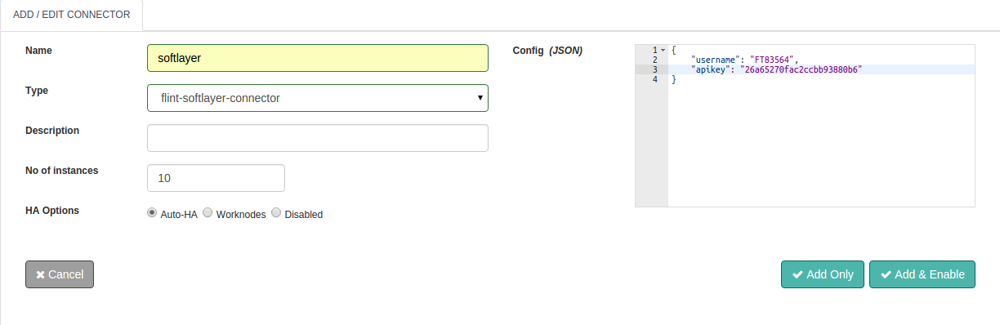

# IBM Softlayer Connector
SoftLayer gives you the highest performing cloud infrastructure available. One platform that takes data centers around the world that are full of the widest range of cloud computing options, and then integrates and automates everything.

With this document guide you will be able to work with and use a SoftLayer Connector. While you start configuring the connector, this document will guide you through SoftLayer Connector request and response parameters.

Perform all standard application operations like Create, Start and Stop operations available through the SoftLayer Connector. Some of them are listed below:
- Create Instance
- Start Instance
- Stop Instance
- Reboot Instance
- Reset Instance
- List Instance
- Details Instance
- Update Instance
- Delete Instance

Also,

The ability to set Connector execution timeouts Synchronous / Asynchronous execution of the Connector

# Configuring Softlayer Connector


## Configuration parameters

Parameter | Description                         | required
--------- | ----------------------------------- |
username  | Softlayer client username           | true: config/request
apikey    | Softlayer client apikey Credentials | true: config/request

# Actions
## create
Create softlayer instance.

### Request parameters

Parameter        | Description                                                   | required
---------------- | ------------------------------------------------------------- |
action           | action to perform: create                                     | true
hostname         | Hostname of the Softlayer Instance                            | true
domainname       | Domainname of the Softlayer Instance                          | true
cpu              | Number of cpu required for the Softlayer Instance             | true
max-memory       | max-memory required for the Softlayer Instance                | true
opearting-system | Opearting system required for the Softlayer Instance          | true
datacenter       | The datacenter where the Softlayer Instance is to be launched | true
username         | The credentials for signing the connector request             | true: config/request
apikey           | The credentials for signing the connector request             | true: config/request

### Response parameters

Parameter | Description                            | required
--------- | -------------------------------------- |
response  | Response Body, with domain name and id | true

### Example

```ruby
response = @call.connector("softlayer_connector_name")
                .set("action","create")
                .set("host-name","myhostname")
                .set("domain-name","http://example.com/")
                .set("cpu",1)
                .set("max-memory",1024)
                .set("datacenter","ams01")
                .set("opearting-system","UBUNTU_LATEST")
                .set("apikey","a23dgn5nmk247gbn85sdebg")
                .set("username","rt784375")
                .sync
ticket_content = response.get("response")  #Response Result, with domain name and id.
```

## start
Start softlayer instance.

### Request parameters

Parameter | Description                                          | required
--------- | ---------------------------------------------------- |
action    | action to perform: start                             | true
id        | Id of the Softlayer Instance which you want to start | true
username  | The credentials for signing the connector request    | true: config/request
apikey    | The credentials for signing the connector request    | true: config/request

### Response parameters

Parameter | Description                           | required
--------- | ------------------------------------- |
response  | Response Body, with operation status. | true

### Example

```ruby

response = @call.connector("softlayer_connector_name")
                .set("action","start")
                .set("id",14580)
                .set("apikey","a23dgn5nmk247gbn85sdebg")
                .set("username","rt784375")
                .sync

ticket_content = response.get("response")  #Response Result, with operation status.
```

## stop
Stop softlayer instance.

### Request parameters

Parameter | Description                                         | required
--------- | --------------------------------------------------- |
action    | action to perform: stop                             | true
id        | Id of the Softlayer Instance which you want to stop | true
username  | The credentials for signing the connector request   | true: config/request
apikey    | The credentials for signing the connector request   | true: config/request

### Response parameters

Parameter | Description                           | required
--------- | ------------------------------------- |
response  | Response Body, with operation status. | true

### Example

```ruby

response = @call.connector("softlayer_connector_name")
                .set("action","stop")
                .set("id",14580)
                .set("apikey","a23dgn5nmk247gbn85sdebg")
                .set("username","rt784375")
                .sync

ticket_content = response.get("response")  #Response Result, with operation status.
```

## reboot
Reboot softlayer instance.

### Request parameters

Parameter | Description                                           | required
--------- | ----------------------------------------------------- |
action    | action to perform: reboot                             | true
id        | Id of the Softlayer Instance which you want to reboot | true
username  | The credentials for signing the connector request     | true: config/request
apikey    | The credentials for signing the connector request     | true: config/request

### Response parameters

Parameter | Description                           | required
--------- | ------------------------------------- |
response  | Response Body, with operation status. | true

### Example

```ruby

response = @call.connector("softlayer_connector_name")
                .set("action","reboot")
                .set("id",14580)
                .set("apikey","a23dgn5nmk247gbn85sdebg")
                .set("username","rt784375")
                .sync

ticket_content = response.get("response")  #Response Result, with operation status.
```

## reset
Reset softlayer instance.

### Request parameters

Parameter | Description                                          | required
--------- | ---------------------------------------------------- |
action    | action to perform: reset                             | true
id        | Id of the Softlayer Instance which you want to reset | true
username  | The credentials for signing the connector request    | true: config/request
apikey    | The credentials for signing the connector request    | true: config/request

### Response parameters

Parameter | Description                           | required
--------- | ------------------------------------- |
response  | Response Body, with operation status. | true

### Example

```ruby

response = @call.connector("softlayer_connector_name")
                .set("action","reboot")
                .set("id",14580)
                .set("apikey","a23dgn5nmk247gbn85sdebg")
                .set("username","rt784375")
                .sync

ticket_content = response.get("response")  #Response Result, with operation status.
```

## list
List all softlayer instances.

### Request parameters

Parameter | Description                                       | required
--------- | ------------------------------------------------- |
action    | action to perform: list                           | true
username  | The credentials for signing the connector request | true: config/request
apikey    | The credentials for signing the connector request | true: config/request

### Response parameters

Parameter | Description                              | required
--------- | ---------------------------------------- |
response  | Response Body, with available instances. | true

### Example

```ruby

response = @call.connector("softlayer_connector_name")
                .set("action","list")
                .set("apikey","a23dgn5nmk247gbn85sdebg")
                .set("username","rt784375")
                .sync

ticket_content = response.get("response")  #Response Result, with available instances.
```

## details
Get details of softlayer instance with provided id.

### Request parameters

Parameter | Description                                        | required
--------- | -------------------------------------------------- |
action    | action to perform: details                         | true
id        | Id of the Softlayer Instance which you want to get | true
username  | The credentials for signing the connector request  | true: config/request
apikey    | The credentials for signing the connector request  | true: config/request

### Response parameters

Parameter  | Description                          | required
---------- | ------------------------------------ |
vm-details | Response Body, with instance detail. | true

### Example

```ruby

response = @call.connector("softlayer_connector_name")
                .set("action","details")
                .set("id",14580)
                .set("apikey","a23dgn5nmk247gbn85sdebg")
                .set("username","rt784375")
                .sync

ticket_content = response.get("vm-details")  #Response Result, with available instances.
```

## update
Update details of softlayer instance with provided id.

### Request parameters

Parameter | Description                                           | required
--------- | ----------------------------------------------------- |
action    | action to perform: update                             | true
id        | Id of the Softlayer Instance which you want to update | true
full-name | Fullname of the instance which you want to give       | false
host-name | The hostname of the instance which you want to give   | true
username  | The credentials for signing the connector request     | true: config/request
apikey    | The credentials for signing the connector request     | true: config/request

### Response parameters

Parameter  | Description                                   | required
---------- | --------------------------------------------- |
vm-details | Response Body, details with updated instance. | true

### Example

```ruby

response = @call.connector("softlayer_connector_name")
                .set("action","update")
                .set("id",14580)
                .set("full-name","infiverve")
                .set("host-name","myhostname")
                .set("apikey","a23dgn5nmk247gbn85sdebg")
                .set("username","rt784375")
                .sync
ticket_content = response.get("vm-details")  #Response Result, with available instances.
```

## delete
Delete instance with provided id.

### Request parameters

Parameter | Description                                           | required
--------- | ----------------------------------------------------- |
action    | action to perform: delete                             | true
id        | Id of the Softlayer Instance which you want to delete | true
username  | The credentials for signing the connector request     | true: config/request
apikey    | The credentials for signing the connector request     | true: config/request

### Response parameters

Parameter | Description                         | required
--------- | ----------------------------------- |
response  | Response Body, with deleted status. | true

### Example

```ruby

response = @call.connector("softlayer_connector_name")
                .set("action","delete")
                .set("id",14580)
                .set("apikey","a23dgn5nmk247gbn85sdebg")
                .set("username","rt784375")
                .sync
ticket_content = response.get("response")  #Response Result, with available instances.
```

# Connector request error handling
Here is how you can handle the connector requests success or failures within your Flintbit. This would help you to take appropriate action if something failed.

```ruby
if response.exitcode == 0               # 0 is success.
  puts "success"
  # take action in case of success
else                                    # non zero means fail
  puts "fail"
  puts "Reason:" + response.message     # get the reason of failure
  ## Take action in case of failure
end
```
