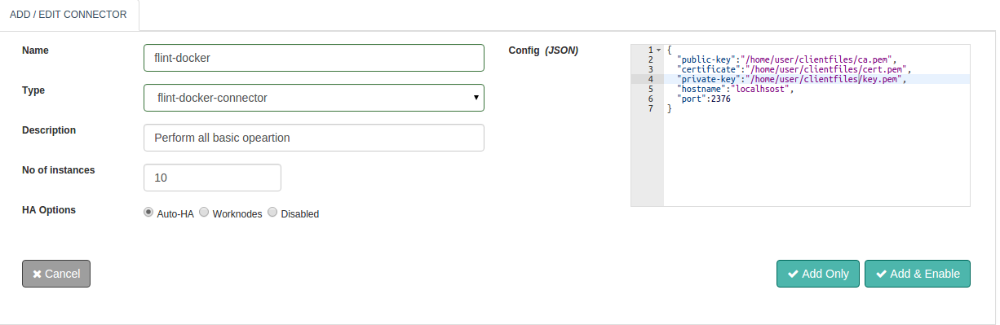

## Docker Connector

Docker containers wrap up a piece of software in a complete filesystem that contains everything it needs to run: code, runtime, system tools, system libraries – anything you can install on a server. This guarantees that it will always run the same, regardless of the environment it is running in..

With this document guide you will be able to work with and use a Docker Connector. While you start configuring the connector, this document will guide you through Docker Connector request and response parameters.

## Design Aspects
Perform all standard application operations like Create, Start and Stop operations available through the Docker rest api. Some of them are listed below:

+ Create Container
+ Inspect Container
+ List Container
+ Pause Container
+ Unpause instance
+ Start Container
+ Stop Container
+ Restart Container
+ Remove Container
+ List Images
+ Process
+ Rename Container
+ Pull Images
Also,

+ The ability to set Connector execution timeouts
+ Synchronous / Asynchronous execution of the Connector


## Configuring DigitalOcean Connector



##### Configuration parameters

| Parameter | Description | required |
| ------ | ----------- |
| public-key | Docker client public-key Credentials | true: config/request |
| certificate | Docker client certificate Credentials | true: config/request |
| private-key | Docker client private-key Credentials | true: config/request |
| hostname | Docker client hostname Credentials | true: config/request |
| port-key | Docker client port Credentials | true: config/request |

##### Example
``` json
{
  "public-key" : "/home/user/client_files/ca.pem",
  "certificate" : "/home/user/client_files/cert.pem",
  "private-key" : "/home/user/client_files/key.pem",
  "hostname" : "localhost",
  "port-key" : 2376
}

```

## Actions

### create
Create container of Docker associated with provided name.

##### Request parameters
| Parameter | Description | required |
| ------ | ----------- |
| action | Contains the name of the operation: create | true |
| name | Contains the name of the docker container: name | true |
| image | Contains the image from which docker container is created: image | true |
| public-key | Specifies the credentials for authenticate the Docker server | true: config/request |
| private-key | Specifies the credentials for authenticate the Docker server | true: config/request |
| certification | Specifies the credentials for authenticate the Docker server | true: config/request |
| port | Port to connect to on the Docker server. | true: config/request |
| hostname | hostname or IP address to connect to on the Docker server. | true: config/request |

##### Response parameters
| Parameter | Description | required |
| ------ | ----------- |
| Warnings | Warnings while creating docker container | true |
| Id | Id of the created docker container | true |

##### Example
``` ruby
response = @call.connector("docker_connector_name")
				.set("action","create")
				.set("image","ubuntu:latest")
				.set("public-key","/home/user/clientFiles/ca.pem")
				.set("certificate","/home/user/clientFiles/cert.pem")
				.set("private-key","/home/user/clientFiles/key.pem")
				.set("hostname","localhost")
				.set("port",2376)
				.set("name","container-name")
				.sync

#Docker Connector Response Meta Parameters
response_exitcode = response.exitcode				#Exit status code
response_message = response.message					#Execution status messages
 
#Docker Connector Response Parameters
warnings=response.get("Warnings")					#Warnings while creating docker container
Id=response.get("Id")								#Id of the created docker container

```

### start
start container of Docker associated with provided name.

##### Request parameters
| Parameter | Description | required |
| ------ | ----------- |
| action | action to perform: start | true |
| id | Contains the id of the docker container which you want to start | true |
| public-key | Specifies the credentials for authenticate the Docker server | true: config/request |
| private-key | Specifies the credentials for authenticate the Docker server | true: config/request |
| certification | Specifies the credentials for authenticate the Docker server | true: config/request |
| port | Port to connect to on the Docker server. | true: config/request |
| hostname | hostname or IP address to connect to on the Docker server. | true: config/request |

##### Response parameters
| Parameter | Description | required |
| ------ | ----------- |
| response-code | response code of the request to docker server | true |
| success | container start successfully it return true otherwise false | true |

##### Example
``` ruby
response = @call.connector("docker_connector_name")
				.set("action","start")
				.set("id","1555a57c363d4f6750f9")
				.set("public-key","/home/user/clientFiles/ca.pem")
				.set("certificate","/home/user/clientFiles/cert.pem")
				.set("private-key","/home/user/clientFiles/key.pem")
				.set("hostname","localhost")
				.set("port",2376)
				.sync

#Docker Connector Response Meta Parameters
response_exitcode = response.exitcode                #Exit status code
response_message = response.message                  #Execution status messages
 
#Docker Connector Response Parameters
response_code=response.get("response-code")          #Response code
response_status=response.get("success")              #Response status

```
### stop
stop container of Docker associated with provided name.

##### Request parameters
| Parameter | Description | required |
| ------ | ----------- |
| action | action to perform: stop | true |
| id | Contains the id of the docker container which you want to stop | true |
| public-key | Specifies the credentials for authenticate the Docker server | true: config/request |
| private-key | Specifies the credentials for authenticate the Docker server | true: config/request |
| certification | Specifies the credentials for authenticate the Docker server | true: config/request |
| port | Port to connect to on the Docker server. | true: config/request |
| hostname | hostname or IP address to connect to on the Docker server. | true: config/request |

##### Response parameters
| Parameter | Description | required |
| ------ | ----------- |
| response-code | response code of the request to docker server | true |
| success | container stopped successfully it return true otherwise false | true |

##### Example
``` ruby
response = @call.connector("docker_connector_name")
				.set("action","stop")
				.set("id","1555a57c363d4f6750f9")
				.set("public-key","/home/user/clientFiles/ca.pem")
				.set("certificate","/home/user/clientFiles/cert.pem")
				.set("private-key","/home/user/clientFiles/key.pem")
				.set("hostname","localhost")
				.set("port",2376)
				.sync

#Docker Connector Response Meta Parameters
response_exitcode = response.exitcode                #Exit status code
response_message = response.message                  #Execution status messages
 
#Docker Connector Response Parameters
response_code=response.get("response-code")          #Response code
response_status=response.get("success")              #Response status
```


### pause
Pause container of Docker associated with provided name.

##### Request parameters
| Parameter | Description | required |
| ------ | ----------- |
| action | action to perform: pause | true |
| id | Contains the id of the docker container which you want to pause | true |
| public-key | Specifies the credentials for authenticate the Docker server | true: config/request |
| private-key | Specifies the credentials for authenticate the Docker server | true: config/request |
| certification | Specifies the credentials for authenticate the Docker server | true: config/request |
| port | Port to connect to on the Docker server. | true: config/request |
| hostname | hostname or IP address to connect to on the Docker server. | true: config/request |

##### Response parameters
| Parameter | Description | required |
| ------ | ----------- |
| response-code | response code of the request to docker server | true |
| success | container paused successfully it return true otherwise false | true |

##### Example
``` ruby
response = @call.connector("docker_connector_name")
				.set("action","pause")
				.set("id","1555a57c363d4f6750f9")
				.set("public-key","/home/user/clientFiles/ca.pem")
				.set("certificate","/home/user/clientFiles/cert.pem")
				.set("private-key","/home/user/clientFiles/key.pem")
				.set("hostname","localhost")
				.set("port",2376)
				.sync

#Docker Connector Response Meta Parameters
response_exitcode = response.exitcode                #Exit status code
response_message = response.message                  #Execution status messages
 
#Docker Connector Response Parameters
response_code=response.get("response-code")          #Response code
response_status=response.get("success")              #Response status
```

### unpause
Unpause container of Docker associated with provided name.

##### Request parameters
| Parameter | Description | required |
| ------ | ----------- |
| action | action to perform: unpause | true |
| id | Contains the id of the docker container which you want to unpause | true |
| public-key | Specifies the credentials for authenticate the Docker server | true: config/request |
| private-key | Specifies the credentials for authenticate the Docker server | true: config/request |
| certification | Specifies the credentials for authenticate the Docker server | true: config/request |
| port | Port to connect to on the Docker server. | true: config/request |
| hostname | hostname or IP address to connect to on the Docker server. | true: config/request |

##### Response parameters
| Parameter | Description | required |
| ------ | ----------- |
| response-code | response code of the request to docker server | true |
| success | container unpaused successfully it return true otherwise false | true |

##### Example
``` ruby
response = @call.connector("docker_connector_name")
				.set("action","unpause")
				.set("id","1555a57c363d4f6750f9")
				.set("public-key","/home/user/clientFiles/ca.pem")
				.set("certificate","/home/user/clientFiles/cert.pem")
				.set("private-key","/home/user/clientFiles/key.pem")
				.set("hostname","localhost")
				.set("port",2376)
				.sync

#Docker Connector Response Meta Parameters
response_exitcode = response.exitcode                #Exit status code
response_message = response.message                  #Execution status messages
 
#Docker Connector Response Parameters
response_code=response.get("response-code")          #Response code
response_status=response.get("success")              #Response status
```

### restart
Restart container of Docker associated with provided name.

##### Request parameters
| Parameter | Description | required |
| ------ | ----------- |
| action | action to perform: restart | true |
| id | Contains the id of the docker container which you want to restart | true |
| public-key | Specifies the credentials for authenticate the Docker server | true: config/request |
| private-key | Specifies the credentials for authenticate the Docker server | true: config/request |
| certification | Specifies the credentials for authenticate the Docker server | true: config/request |
| port | Port to connect to on the Docker server. | true: config/request |
| hostname | hostname or IP address to connect to on the Docker server. | true: config/request |

##### Response parameters
| Parameter | Description | required |
| ------ | ----------- |
| response-code | response code of the request to docker server | true |
| success | container restart successfully it return true otherwise false | true |

##### Example
``` ruby
response = @call.connector("docker_connector_name")
				.set("action","restart")
				.set("id","1555a57c363d4f6750f9")
				.set("public-key","/home/user/clientFiles/ca.pem")
				.set("certificate","/home/user/clientFiles/cert.pem")
				.set("private-key","/home/user/clientFiles/key.pem")
				.set("hostname","localhost")
				.set("port",2376)
				.sync

#Docker Connector Response Meta Parameters
response_exitcode = response.exitcode                #Exit status code
response_message = response.message                  #Execution status messages
 
#Docker Connector Response Parameters
response_code=response.get("response-code")          #Response code
response_status=response.get("success")              #Response status
```

### remove
Remove container of Docker associated with provided name.

##### Request parameters
| Parameter | Description | required |
| ------ | ----------- |
| action | action to perform: remove | true |
| id | Contains the id of the docker container which you want to remove | true |
| public-key | Specifies the credentials for authenticate the Docker server | true: config/request |
| private-key | Specifies the credentials for authenticate the Docker server | true: config/request |
| certification | Specifies the credentials for authenticate the Docker server | true: config/request |
| port | Port to connect to on the Docker server. | true: config/request |
| hostname | hostname or IP address to connect to on the Docker server. | true: config/request |

##### Response parameters
| Parameter | Description | required |
| ------ | ----------- |
| response-code | response code of the request to docker server | true |
| success | container removed successfully it return true otherwise false | true |

##### Example
``` ruby
response = @call.connector("docker_connector_name")
				.set("action","remove")
				.set("id","1555a57c363d4f6750f9")
				.set("public-key","/home/user/clientFiles/ca.pem")
				.set("certificate","/home/user/clientFiles/cert.pem")
				.set("private-key","/home/user/clientFiles/key.pem")
				.set("hostname","localhost")
				.set("port",2376)
				.sync

#Docker Connector Response Meta Parameters
response_exitcode = response.exitcode                #Exit status code
response_message = response.message                  #Execution status messages
 
#Docker Connector Response Parameters
response_code=response.get("response-code")          #Response code
response_status=response.get("success")              #Response status
```

### pull
pull image of Docker associated with provided name.

##### Request parameters
| Parameter | Description | required |
| ------ | ----------- |
| action | action to perform: pull | true |
| image | Contains the image with tag which you want to pull docker hub registry | true |
| public-key | Specifies the credentials for authenticate the Docker server | true: config/request |
| private-key | Specifies the credentials for authenticate the Docker server | true: config/request |
| certification | Specifies the credentials for authenticate the Docker server | true: config/request |
| port | Port to connect to on the Docker server. | true: config/request |
| hostname | hostname or IP address to connect to on the Docker server. | true: config/request |

##### Response parameters
| Parameter | Description | required |
| ------ | ----------- |
| result | Pulled image result | true |


##### Example
``` ruby
response = @call.connector("docker_connector_name")
				.set("action","remove")
				.set("image","ubuntu:latest")
				.set("public-key","/home/user/clientFiles/ca.pem")
				.set("certificate","/home/user/clientFiles/cert.pem")
				.set("private-key","/home/user/clientFiles/key.pem")
				.set("hostname","localhost")
				.set("port",2376)
				.sync

#Docker Connector Response Meta Parameters
response_exitcode = response.exitcode				#Exit status code
response_message = response.message					#Execution status messages
 
#Docker Connector Response Parameters
response_code=response.get("result")				#Pulled image result
```

## Connector request error handling

Here is how you can handle the connector requests success or failures within your Flintbit. This would help you to take appropriate action if something failed.

``` ruby
if response.exitcode == 0               # 0 is success.
  puts "success"
  # take action in case of success
else                                    # non zero means fail
  puts "fail"
  puts "Reason:" + response.message     # get the reason of failure
  ## Take action in case of failure
end

```
