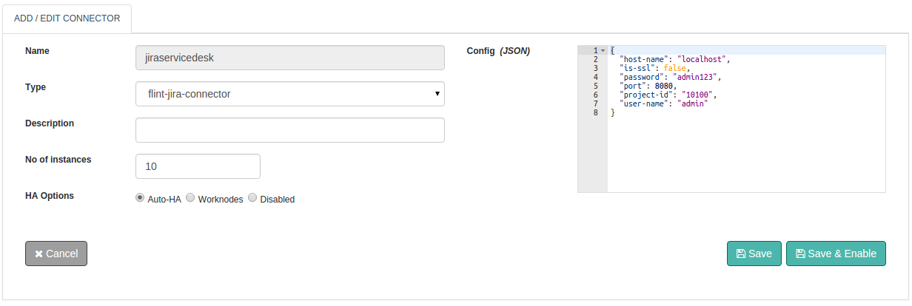

## Jira Connector

With Flint's Jira Connector you can perform Create , Add comment, Update Comment ,Delete, Resolve , Add worklog and Notify operations on a issue.

With this document guide you will be able to work with and use a Jira Connector.While you start configuring the connector, this document will guide you through Jira Connector request and response parameters.

## Jira Service Desk Features

With JIRA Service Desk, we’ve gone beyond the powerful JIRA platform and added service desk-specific capabilities such as :

+ Allows you to perform "RESTful" operations.
+ Jira service desk is easy to use and powerfull manage engine.
+ Simple to use
+ Intuitive Interface
+ Powerfull SLAs
+ Real time report
+ Custome team queues


## Design Aspects
Perform all standard application operations like Create , Add comment, Update Comment ,Delete, Resolve , Add worklog and Notify to issue operations available through the Jira connector. Some of them are listed below:

+ Allows you to perform "RESTful" operations.
+ Create issue of type : Incident, Service Request, Problem, change with custom fields.
+ Add comment to an issue.
+ Update Comment.
+ Delete issue.
+ Resolve issue.
+ Add worklog to an issue.

## Configuring Jira connector



##### Configuration parameters

| Parameter | Description | required |
| ------ | ----------- |
| port | Port on which Jira service desk running | true |
| host-name | Own unique identifier or URI. If you want to access data from helpdesk you need this unique identifier or URI. | true |
| is-ssl |  Is your domain access secure web services. | false |
| password |  Password id associated with your Jira account. | true |
| project-id | Id associated with project. | true |
| user-name | User name associated with your Jira account. | true |

## Actions

### add-Comment
Adds a new comment to an issue.

##### Request parameters
| Parameter | Description | required |
| ------ | ----------- |
| action | action to perform: add-comment | true |
| comment | Comment text | true |
| issue-id |Issue id  | true |
| type | for which type of user you want to restrict comment e.g. role | false
| value | value of the role e.g Administrators | false


##### Response parameters
| Parameter | Description | required |
| ------ | ----------- |
| body | Response Body, Data related to issue | true |

##### Example
``` ruby
response=@call.connector("jira_connector_name")    
              .set("action","add-comment")
              .set("comment","Deploye tested code on server. ")
              .set("issue-id",1)
              .set("type","role")
              .set("value","Administrators")
              .sync

ticket_content = response.get("body")  #Response Result, ticket information from jira servicedesk.
```

### create-issue
Create an issue.

##### Request parameters
| Parameter | Description | required |
| ------ | ----------- |
| action | action to perform: create-issue | true |
| summary | Title of issue. | true |
| description | Description related to issu |  |false
| issuetype |Type of issue. i.e Service Request, incident, Problem or Change | false
| priority | Priority of issue. i.e. Highest=1, High=2, Medium=3, Low=4, Lowest=5   
| true
| components | Components ids | false
| labels |  Components labels | false
| duedate | Due date of issue| false
| reporter | Reporter of the issue | false
| assignee | Assignee of the isssue | false
| custom-field | Custom fields | false

##### Response parameters
| Parameter | Description | required |
| ------ | ----------- |
| body | Response Body, Data related to issue | true |

##### Example
``` ruby
response = @call.connector("jira_connector_name")
                .set("action","create-issue")
                .set("summary","something wrong.")               
 	              .set("description","System is not working properly.")
 	              .set("issuetype","Service Request")
 	              .set("priority","4")
 	              .set("components",["10106","10105"],
 	              .set("labels",["bugfix","blitz_test"])
 	              .set("duedate","2016-03-11")
 	              .set("reporter","Admin")
 	              .set("assignee","smith")
 	              .set("custom-field",[{"Operating System": "Ubuntu"})
                .sync

ticket_content = response.get("body")  #Response Result, ticket information from jira servicedesk.
```
### get-user
Returns a user.

##### Request parameters

| Parameter | Description | required |
| ------ | ----------- |
| action | action to perform: get-user | true |
| username | User name | true |

##### Response parameters
| Parameter | Description | required |
| ------ | ----------- |
| body | Response Body, Data related to issue | true |

##### Example
``` ruby
response = @call.connector("jira_connector_name")
                .set("action","get-user")
                .set("username", "admin")
                .sync

ticket_content = response.get("body")  #Response Result, ticket information from jira servicedesk.
```

### resolve-issue
Resolve issue.

##### Request parameters

| Parameter | Description | required |
| ------ | ----------- |
| action | action to perform:resolve-issue | true |
| comment | Comment on issue | false |
| issue-id | Issue id to resolve | true |

##### Response parameters
| Parameter | Description | required |
| ------ | ----------- |
| body | Response Body, Data related to issue | true |

##### Example
``` ruby
response = @call.connector("jira_connecor_name")
                .set("action","resolve-issue")
                .set("comment","Virtual machine provision done successfully")
                .set("issue-id","IT-76")
                .sync

ticket_content = response.get("body")  #Response Result, ticket information from jira servicedesk.
```

### add-worklog
Add worklog to an issue.

##### Request parameters

| Parameter | Description | required |
| ------ | ----------- |
| action | action to perform: add-worklog | true |
| comment | Comment on issue | false |
| issue-id | Issue id to resolve | true |
| started | Started time | true |
| adjust-estimate | Possible values for adjust estimate are: new,manual,auto and leave  | true |
| new-estimate | Provide only when adjust-estimate is new | true if adjust_estimate = "new" |
| reduce-by | Provide only when adjust-estimate is manual | true if adjust_estimate = "manual"

##### Response parameters
| Parameter | Description | required |
| ------ | ----------- |
| body | Response Body, Data related to issue | true |

##### Example for adjust-estimate = "new"
``` ruby
response = @call.connector("jira_connecor_name")
                .set("action","add-worklog")
                .set("comment","Virtual machine provision done successfully")
                .set("issue-id","IT-76")
                .set("started","2015-10-07T00:32:50.877+0000") 	
                .set("timeSpent","2d 3h")
                .set("adjust-estimate","new")
                .set("new-estimate", "2d")
                .sync

ticket_content = response.get("body")  #Response Result, ticket information from jira servicedesk.
```
##### Example for adjust-estimate = "manual"

``` ruby
response = @call.connector("jira_connecor_name")
                .set("action","add-worklog")
                .set("comment","Virtual machine provision done successfully")
                .set("issue-id","IT-76")
                .set("started","2015-10-07T00:32:50.877+0000") 	
                .set("timeSpent","2d 3h")
                .set("adjust-estimate","new")
                .set("reduce-by", "3h")
                .sync

ticket_content = response.get("body")  #Response Result, ticket information from jira servicedesk.

```
##### Example for adjust-estimate = "leave"

``` ruby
response = @call.connector("jira_connecor_name")
                .set("action","add-worklog")
                .set("comment","Virtual machine provision done successfully")
                .set("issue-id","IT-76")
                .set("started","2015-10-07T00:32:50.877+0000") 	
                .set("timeSpent","2d 3h")
                .set("adjust-estimate","leave")
                .sync

ticket_content = response.get("body")  #Response Result, ticket information from jira servicedesk.
```
##### Example for  adjust-estimate = "auto"
``` ruby
response = @call.connector("jira_connecor_name")
                .set("action","add-worklog")
                .set("comment","Virtual machine provision done successfully")
                .set("issue-id","IT-76")
                .set("started","2015-10-07T00:32:50.877+0000") 	
                .set("timeSpent","2d 3h")
                .set("adjust-estimate","auto")
                .sync

ticket_content = response.get("body")  #Response Result, ticket information from jira servicedesk.                

```

### notify
Sends a notification to the list or recipients defined in the request.

##### Request parameters

| Parameter | Description | required |
| ------ | ----------- |
| action | action to perform: notify | true |
| body | Email body | true |
| subject | Email subject | true |
| reporter | if you want notify to reporter | false |
| assignee | if you want notify to assignee | false |
| watcher | if you want to notify watcher | false |
| voters | if you want to notify voters | false |

##### Response parameters
| Parameter | Description | required |
| ------ | ----------- |
| body | Response Body, Data related to issue | true |

##### Example
``` ruby
response = @call.connector("jira_connecor_name")
                .set("action","notify")
                .set("issue-id","IT-76")
                .set("body","Virtual machine start request is still in pending request.")
                .set("subject","Regarding virtual machine start action")
                .set("reporter",true)
                .set("assignee",true)
                .set("watcher",false)
                .set("voters",false)  
                .sync

ticket_content = response.get("body")  #Response Result, ticket information from jira servicedesk.
```

## Connector request error handling

Here is how you can handle the connector requests success or failures within your Flintbit. This would help you to take appropriate action if something failed.

``` ruby
if response.exitcode == 0               # 0 is success.
  puts "success"
  # take action in case of success
else                                    # non zero means fail
  puts "fail"
  puts "Reason:" + response.message     # get the reason of failure
  ## Take action in case of failure
end

```
