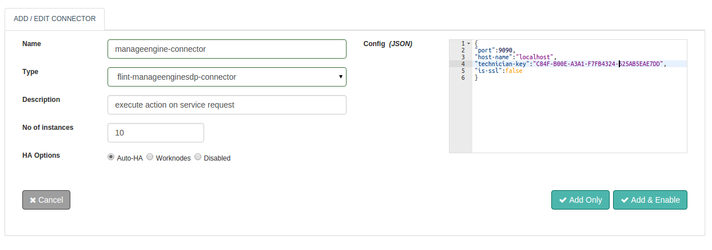

# ManageEngine Connector
With Flint's ManageEngine Service desk Connector you can perform Get Request , Update Request, Close Request and Add note on a ticket. You can configure your connector with Flint's ManageEngine Service desk Connector to suite your special demands without the need to extend or replace any inbuilt code. After configuring, with your scripting skills Flint will automate the workflow.Thus, without any compromise Performance, Stability and Flexibility all are packaged into Flint's ManageEngine Service desk Connector Connector. With this document guide you will be able to work with and use a ManageEngine Service desk Connector.While you start configuring the connector, this document will guide you through Manage Engine Service desk Connector request and response parameters.

# Design Aspects
Perform all standard application operations like Get Request , Update Request, Close Request and Add note to Ticket operations available through the ManageEngine Service desk connector. Some of them are listed below:
- Operations are performed using REST API
- Based on operation request will send through specific method
- Technician Key is required for authentication.
- Provide advanced ITSM functionality.
- Easy to use capability
- The ability to set Connector execution timeouts

# Configuring ManageEngine connector


## Configuration parameters

Parameter      | Description                                                   | required
-------------- | ------------------------------------------------------------- |
port           | Port number on which your manage engine service desk running. | true
host-name      | Host on which your manage engine service desk running.        | true
is-ssl         | Is your domain access secure web services.                    | false
technician-key | Password id associated with your Jira account.                | true

## Example

```json
{
  "port":9090,
  "host-name":"localhost",
  "technician-key":"C84F-B00E-A3A1-F7FB4324-625AB5EAE7DD",
  "is-ssl":false
}
```

# Actions
# get-request
Get details of provided service request.

## Request parameters

Parameter      | Description                                                  | required
-------------- | ------------------------------------------------------------ |
action         | action to perform: get-request                               | true
port           | Port number on which your manage engine service desk running | true: config/request
host-name      | Host on which your manage engine service desk running.       | true config/request
is-ssl         | Is your domain access secure web services.                   | false
technician-key | Technician key associated with ManageEngine.                 | true config/request

## Response parameters

Parameter | Description                           | required
--------- | ------------------------------------- |
response  | Response Body, list of all instances. | true

## Example

```ruby
response=@call.connector("manageengine_connector_name")    
              .set("port",9090)
              .set("host-name","localhost")   
              .set("is-ssl",false)
              .set("technician-key","C84F-B00E-A3A1-F7FB4324-625AB5EAE7DD")
              .set("action","get-request")
              .set("request-id",17)
              .sync

ticket_content = response.get("response")  #Response Result,service request details of provided request id.
```

# update-request
Update service request for provided request id.

## Request parameters

Parameter       | Description                                                  | required
--------------- | ------------------------------------------------------------ |
action          | action to perform: update-request                            | true
port            | Port number on which your manage engine service desk running | true: config/request
host-name       | Host on which your manage engine service desk running.       | true config/request
is-ssl          | Is your domain access secure web services.                   | false
technician-key  | Technician key associated with ManageEngine.                 | true config/request
request-id      | Request Id that you want to update.                          | true
requester       | Requester who requested update request.                      | true
subject         | Subject of the request.                                      | true
description     | Description of the request.                                  | false
requesttemplate | Template of the request.                                     | false
priority        | Priority given to the request.                               | false
site            | Site of the request.                                         | false
group           | Group to which the request belongs.                          | false
technician      | Technician assigned to the request.                          | false
level           | Level of the request.                                        | false
status          | Status of the request.                                       | false
service         | Service category to which the request belongs.               | false

## Response parame

Parameter | Description                           | required
--------- | ------------------------------------- |
response  | Response Body, list of all instances. | true

## Example

```ruby
response=@call.connector("manageengine_connector_name")    
              .set("port",9090)
              .set("host-name","localhost")   
              .set("is-ssl",false)
              .set("technician-key","C84F-B00E-A3A1-F7FB4324-625AB5EAE7DD")
              .set("action","get-request")
              .set("request-id",17)
              .set("requester","administrator")
              .set("subject","Testing update service request")
              .set("description","Specific descriptio")
              .set("requesttemplate","Unable to browse")
              .set("priority","Low")
              .set("site","-")
              .set("group","Network")
              .set("technician","John")
              .set("level","Tier 3")
              .set("status","Close")
              .set("service",@service)
              .timeout(10000)                                                 
              .sync

ticket_content = response.get("response")  #Response Result, details of provided request id.
```

# close-request
Close request with provided request id.

## Request parameters

Parameter      | Description                                                  | required
-------------- | ------------------------------------------------------------ |
action         | action to perform: close-request                             | true
port           | Port number on which your manage engine service desk running | true: config/request
host-name      | Host on which your manage engine service desk running.       | true config/request
is-ssl         | Is your domain access secure web services.                   | false
technician-key | Technician key associated with ManageEngine.                 | true config/request
request-id     | Request Id that you want to update.                          | true
close-accepted | Close request Accepted or not.                               | true
close-comment  | Comment while closing request.                               | false

## Response parameters

Parameter | Description                           | required
--------- | ------------------------------------- |
response  | Response Body, list of all instances. | true

## Example

```ruby
response=@call.connector("manageengine_connector_name")    
              .set("port",9090)
              .set("host-name","localhost")   
              .set("is-ssl",false)
              .set("technician-key","C84F-B00E-A3A1-F7FB4324-625AB5EAE7DD")
              .set("action","get-request")
              .set("request-id",17)
              .set("close-accepted","Accepted")
              .set("close-comment","Virtual machine provision successfully")                               
              .sync

ticket_content = response.get("response")  #Response Result, details of provided request id.
```

# add-note
Add note in provided request.

## Request parameters

Parameter      | Description                                                  | required
-------------- | ------------------------------------------------------------ |
action         | action to perform: add-note                                  | true
port           | Port number on which your manage engine service desk running | true: config/request
host-name      | Host on which your manage engine service desk running.       | true config/request
is-ssl         | Is your domain access secure web services.                   | false
technician-key | Technician key associated with ManageEngine.                 | true config/request
request-id     | Request Id that you want to update.                          | true
ispublic       | Used to represent whether note is public or private.         | false
notetext       | Text to be entered as note.                                  | true

## Response parameters

Parameter | Description                           | required
--------- | ------------------------------------- |
response  | Response Body, list of all instances. | true

## Example

```ruby
response=@call.connector("manageengine_connector_name")    
              .set("port",9090)
              .set("host-name","localhost")   
              .set("is-ssl",false)
              .set("technician-key","C84F-B00E-A3A1-F7FB4324-625AB5EAE7DD")
              .set("action","get-request")
              .set("request-id",17)
              .set("ispublic","false")
              .set("notetext","Create Virtual machine with CentOS.")                               
              .sync

ticket_content = response.get("response")  #Response Result, details of provided request id.
```

# Connector request error handling
Here is how you can handle the connector requests success or failures within your Flintbit. This would help you to take appropriate action if something failed.

```ruby
if response.exitcode == 0               # 0 is success.
  puts "success"
  # take action in case of success
else                                    # non zero means fail
  puts "fail"
  puts "Reason:" + response.message     # get the reason of failure
  ## Take action in case of failure
end
```
