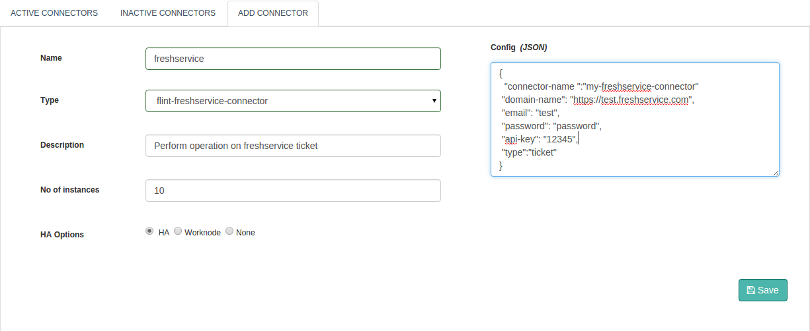

## freshservice Connector

With Flint's Freshservice Connector, we can perform operations like create, view, update and add note to a ticket.

With this document, we will be able to use and work with the Freshservice connector.
## Design Aspects

Perform all standard application operations like Create Ticket, View Ticket, Update Ticket and Add Note to Ticket operations available through the freshservice connector. Some of them are listed below:

+ Allows you to perform "RESTful" operations.
+ Add note to a ticket.
+ Get details of ticket.
+ Update ticket.
+ Create ticket.

## Configuring freshservice connector



#####Configuration parameters
| Parameter | Description | required |
| ------ | ----------- |
| domain-name | Name of the domain associated with your freshservice account. | true |
| email | Email address associated with your freshservice account. | true |
| password  | Password associated with your freshservice account. | Optional |
| api-key | API key associated with your freshservice account. | Optional |
| type | freshservice component on which actions will be performed like ticket, user, department, Currently, actions can only be performed on the component of type ticket. | Optional |

##Example
``` json
{
  "domain-name": "https://test.freshservice.com",
  "email": "test@gmail.com",
  "password": "password",
  "api-key": "JrJGC4vDqQRW7Oh4bGF",
  "type":"ticket"
}

```

## Actions

### create
Create ticket in freshservice service desk.

##### Request parameters
| Parameter | Description | required |
| ------ | ----------- |
| action | action to perform: create | true |
| subject | Ticket subject | true |
| description | Content of ticket | false
| ticket-type | Type of ticket | true
| cc-emails | Email address added in the 'cc' field of the incoming ticket email | false
| priority | Ticket priority | true
| status | Ticket status | true
| source | Ticket source | true
| custom-fields | Custom field of ticket | false
| requester-id | User id of ticket requester | true
| responder-id | ID of the User to whom the ticket is assigned | true
| group-id | Id of Group to which the ticket is assigned | false
| department-id | Id of the associated department | false

##### Response parameters
| Parameter | Description | required |
| ------ | ----------- |
| result | Response Body, Data related to ticket | true |

##### Example
``` ruby
response = @call.connector("freshservice_connecor_name")
                .set("action","create")
                .set("subject","Flint on localhost")
                .set("description","UI not appearing")
                .set("ticket-type","Incident")
                .set("cc-emails",["example@test.com"])
                .set("priority",4)
                .set("status",5)
                .set("source",4)
                .set("custom-fields",["task_31127:category 2"])
                .set("requester-id",216)
                .set("responder-id" , 321)
                .set("group-id",145)
                .set("department-id",795)
                .sync

ticket_content = response.get("result")  #Response Result, ticket information from freshservice.
```


### update
Update content to ticket.

##### Request parameters
| Parameter | Description | required |
| ------ | ----------- |
| action | action to perform: create | true |
| ticket-id | Ticket id | false |
| subject | Ticket subject |  |false
| description | Content of ticket | false
| ticket-type | Type of ticket | true
| cc-emails | Email address added in the 'cc' field of the incoming ticket email | false
| priority | Ticket priority | false
| status | Ticket status | false
| source | Ticket source | false
| custom-fields | Custom field of ticket | false
| requester-id | User id of ticket requester | true
| responder-id | ID of the User to whom the ticket is assigned | false
| group-id | Id of Group to which the ticket is assigned | false
| department-id | Id of the associated department | false

##### Example
``` ruby
response = @call.connector("freshservice_connecor_name")
                .set("action","update")
                .set("ticket-id",1)
                .set("subject","Flint on localhost")
                .set("description","UI not appearing")
                .set("ticket-type","Incident")
                .set("cc-emails",["example@test.com"])
                .set("priority",4)
                .set("status",5)
                .set("source",4)
                .set("custom-fields",["task_31127:category 2"])
                .set("requester-id",12345)
                .set("responder-id" , 123456)
                .set("group-id",145)
                .set("department-id",795)
                .sync


```
### view-ticket
Retrive and view a specific ticket.

##### Request parameters

| Parameter | Description | required |
| ------ | ----------- |
| action | action to perform: view-ticket | true |
| ticket-id | Ticket id | true |


##### Example
``` ruby
response = @call.connector("freshservice_connecor_name")
                .set("action","view-ticket")
                .set("ticket-id",1)
                .sync

```

### add-note
Add notes to a ticket - private or public

##### Request parameters

| Parameter | Description | required |
| ------ | ----------- |
| action | action to perform: add-note | true |
| ticket-id | Ticket id | true |

##### Example
``` ruby
response = @call.connector("freshservice_connecor_name")
                .set("action","add-note")
                .set("ticket-id",1)
                .set("body","Still not able to view Flint UI.")         
                .set("private",true)
                .set("to-emails",["test@gmail.com"])
                .set("user-id",12345)
                .sync

response_result = response.get("result") #Add note execution results
```

## Connector response
Here is how to interpret connector response.
``` ruby
if response.exitcode == 0               # 0 is success.
  puts "success"
  # take action in case of success
else                                    # non zero means fail
  puts "fail"
  puts "Reason:" + response.message     # get the reason of failure
  ## Take action in case of failure
end

```
