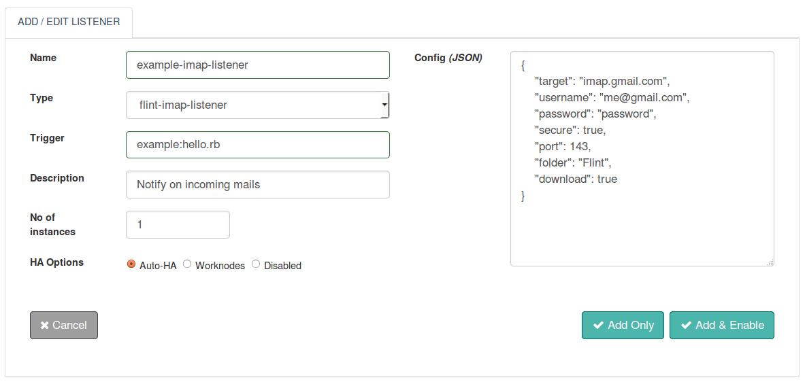

## Introduction
With Flint's IMAP Listener you can monitor incoming messages, alerts, notifications etc. and thus trigger flint to take relevant action that could be integration with other applications or systems based on the IMAP protocol. You can configure your email account with Flint's IMAP Listener to suite your special demands without the need to extend or replace any inbuilt code. After configuring, with your scripting skills Flint will automate the workflow.

All email messages popped in can be used to trigger any workflow further or can be just logged in.Without any compromise Performance, Stability and Flexibility all are packaged into Flint's IMAP Listener.


## Features
* Based on Standardized IMAP Protocol
* Secure/Non-encrypted IMAP Server
* Access to usernames/email-addresses multiple recipients of the email message
* Ability to monitor incoming email messages into folders other than inbox
* Access to names of the attachments along with the email message
* Ability to download the attachments along with the email message
* Access to the sender username/email-address of the email message
* Email subject and email body of the incoming email message are also accessible
* Recipients whose usernames/email addresses mentioned in Carbon Copy ( cc ) and Blind Carbon Copy ( bcc ) are also accessible


### Configuring a IMAP Listener

The following screenshot shows IMAP Listener Configuration parameters.



#### Configuration parameters - Config (JSON)

| Parameters | Required | Description |
| ------| ------ | ----------- |
| target   |true| Host name or IP address of the IMAP server |
| user | true	| Username is the full email address of the email account to be monitored |
| password    | true | Password associated with the email account to be monitored |
| secure    | false | Specify value to be true for a secure IMAP SSL/TLS server. Otherwise, false for an non-encrypted server. Default value is false if not specified |
| port   | false | Port number on which the IMAP server is listening. If nothing is specified and secure parameter is false a default value of 143 will be used and if secure parameter is true 993 will be used. |
| folder | false	| Folder which has to be monitored for incoming mails. If not specified inbox folder will be monitored by default |
| download  | false | If specified true, the attachments along with the incoming email message will be downloaded to the : /flint-installation-directory/downloads |

#### Example Configuration
``` json
{
  "target":"imap.gmail.com",
  "user" : "me@gmail.com",
  "password": "password",
  "secure": false,
  "port": 143,
  "folder": "flint",
  "download":true
}
```

### Configuring a IMAP Listener
Configuring IMAP listener to listen to IMAP server need some parameters

#### Configuration parameters

| Parameters | Required | Description |
| ------| ------ | ----------- |
| target   |true| Host name or IP address of the IMAP server |
| user | true	| Username is the full email address of the email account to be monitored |
| password    | true | Password associated with the email account to be monitored |
| secure    | false | Specify value to be true for a secure IMAP SSL/TLS server. Otherwise, false for an non-encrypted server. Default value is false if not specified |
| port   | false | Port number on which the IMAP server is listening. If nothing is specified and secure parameter is false a default value of 143 will be used and if secure parameter is true 993 will be used. |
| folder | false	| Folder which has to be monitored for incoming mails. If not specified inbox folder will be monitored by default |
| download  | false | If specified true, the attachments along with the incoming email message will be downloaded to the : /flint-installation-directory/downloads |

#### Example Configuration

``` json
{
  "target":"imap.gmail.com",
  "user" : "me@gmail.com",
  "password": "password",
  "secure": false,
  "port": 143,
  "folder": "flint",
  "download":true
}
```

### Access IMAP Message in trigger flintbit

``` ruby
## Ruby example
from = @input.get("from")
to = @input.get("to")
trigger = @input.get("trigger")
cc = @input.get("cc")
subject = @input.get("subject")
date = @input.get("date")
body = @input.get("body")
content_type = @input.get("content-type")
```

```
// Groovy example
String from = input.get("from")
String to = input.get("to")
String trigger = input.get("trigger")
String cc = input.get("cc")
String subject = input.get("subject")
String date = input.get("date")
String body = input.get("body")
String content_type = input.get("content-type")
```
