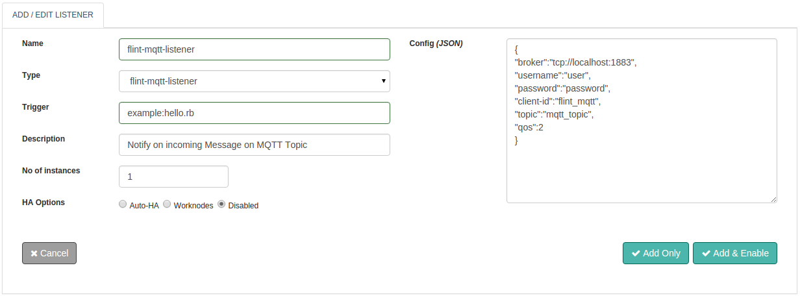

## Introduction
With Flint's MQTT Listener you can monitor incoming messages on your MQTT Topic and thus trigger flint to take relevant action that could be integration with other applications or systems based on the MQTT protocol. You can configure your mqtt topic with Flint's MQTT Listener to suite your special demands without the need to extend or replace any inbuilt code. After configuring, with your scripting skills Flint will automate the workflow.

All messages published on MQTT Topic can be used to build any workflow further or can be just logged in.Without any compromise Performance, Stability and Flexibility all are packaged into Flint's MQTT Listener.


## Features
* Based on Standardized MQTT Protocol.
* Access to MQTT server using SSL and TCP protocol.
* Secure access to MQTT Server by using Username and Password.
* Secure access to MQTT Server by using Certificate files.
* Ability to monitor incoming messages on MQTT Topic.
* Access to messages of the MQTT Topic.
* Secure/Non-encrypted MQTT Server


### Configuring a MQTT Listener

The following screenshot shows MQTT Listener Configuration parameters.



#### Configuration parameters - Config (JSON)

| Parameters | Required | Description |
| ------| ------ | ----------- |
| broker   |true| broker/server URI of the remote mqtt server you wish to connect to |
| username | true	| Username which will be used to log into remote MQTT broker, required for authentication |
| password    | true | Password associated with the username specified, required for authentication |
| client-id   | true | A client identifier client-id, It must be unique across all clients connecting to the same server. |
| qos | false	| Sets the quality of service for this message, default is 2. |
| topic  | true | Listen to the topic |

#### Example Configuration
``` json
{
  "broker":"tcp://hostname:1883",
  "client-id" : "mqtt-test",
  "topic": "mqtt-listener-topic",
  "qos": 1,
  "username": "admin",
  "password": "pwd"
}
```

### Configuring a MQTT Listener for AWS IoT
Configuring MQTT listener to listen to AWS IoT topic need some extra parameters

#### Configuration parameters

| Parameters | Required | Description |
| ------| ------ | ----------- |
| broker   |true| broker/server URI of the remote mqtt server you wish to connect to |
| root-ca-crt  | true	| Path of root-CA.crt certificate file to authenticate MQTT Client. |
| certificate    | true | Path of x.509 certificate file to authenticate MQTT Client. |
| private-key    | true | Path of Private Key certificate file to authenticate MQTT Client. |
| client-id | false	| A client identifier client-id, It must be unique across all clients connecting to the same server. |
| qos | false	| Sets the quality of service for this message, default is 2. |
| topic  | true | Listen to the topic |
| use-certificate | false	| Set true if you want to authenticate using Certificate files |

#### Example Configuration

``` json
{
   "broker":"ssl://FKFXXXXXXX.iot.us-west-2.amazonaws.com:8883",
   "client-id":"mqtt-test",
   "qos":1,
   "topic":"$aws/things/flint-listener-thing/shadow/update",
   "root-ca-crt":"/home/user/flint-mqtt/root-CA.crt",
   "certificate":"/home/user/flint-mqtt/a68178-certificate.pem.crt",
   "private-key":"/home/user/flint-mqtt/a68178-private.pem.key",
   "use-certificate":true
}

```

### Access MQTT Message in trigger flintbit

``` ruby
## Ruby example
message = @input.get("message")
qos = @input.get("qos")
trigger = @input.get("trigger")
topic = @input.get("topic")

```

```
// Groovy example
String message = input.get("message")
integer qos = input.get("qos")
String trigger = input.get("trigger")
String topic = input.get("topic")

```
