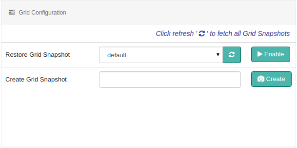

## Create/Restore Grid Configuration

Grid snapshot in Flint, is a view of flintbox, connectors, listeners and global config grid configurations as well as existing users information that existed during creation of the snapshot.

You might need to keep changing the grid configurations as per demand of your appication. Also, the need of the hour may ask you to rollback to any of the previously configured connector or a flintbox. When such circumstances arise, snapshots come handy.

Flint provides a default snapshot named **default** which holds all the basic grid configurations it had while starting flint.

Currently, **Create Grid Snapshot** and **Restore Grid Snapshot** features are available with Flint.

### Create Grid Snapshot

Creating a snapshot will capture the current state of grid configurations of flintbox, connectors, listeners and global config irrespective of their status i.e. enabled or disabled along with the users and their details added by the administrator to flint. Just provide the name of snapshot, basically an identifier and click on the button next to it.

### Restore Grid Snapshot

You can rollback to any of the previous grid configurations. Along with the default snapshot, all the snapshots created by you are available as a list here. Just select the name of snapshot to be restored from the list displayed and click on the button next to it.
